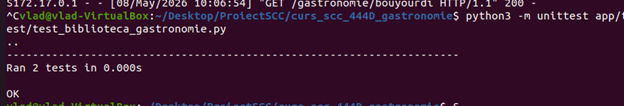
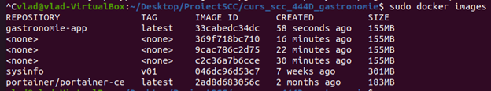
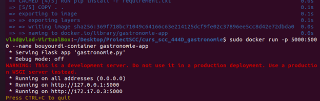
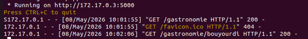
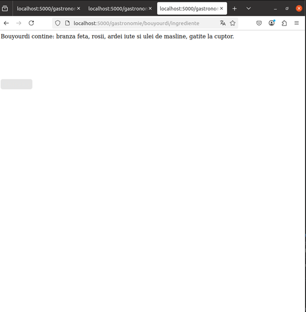

### Dovezi Implementare și Testare
#### Teste Unitare
Toate testele au trecut cu succes, validând logica bibliotecii:

#### Containerizare Docker
Aplicația a fost împachetată și rulată într-un container izolat:
- **Imagine creată:** 
- **Execuție container:** 

#### Verificare Funcționalitate
Logurile de acces și vizualizarea în browser confirmă funcționarea corectă:
- **Loguri Consolă:** 
- **Browser:** 