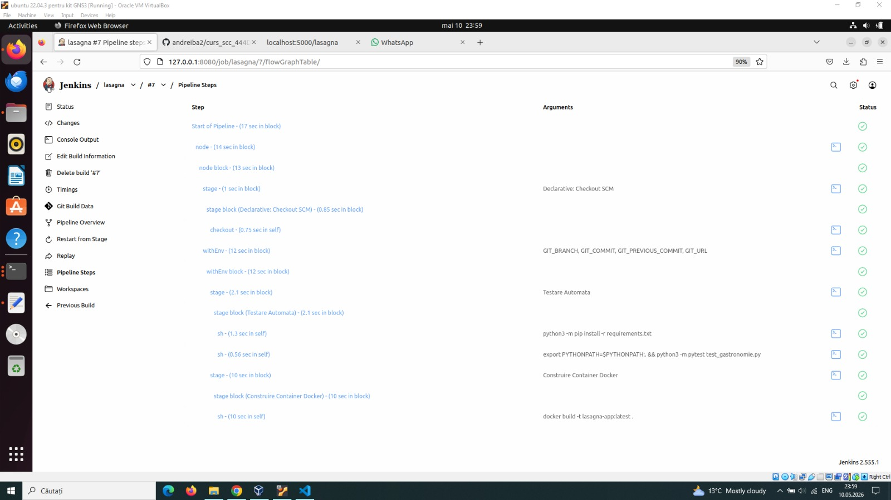
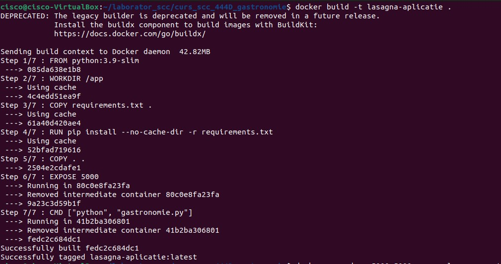
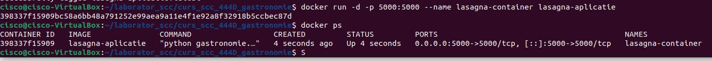
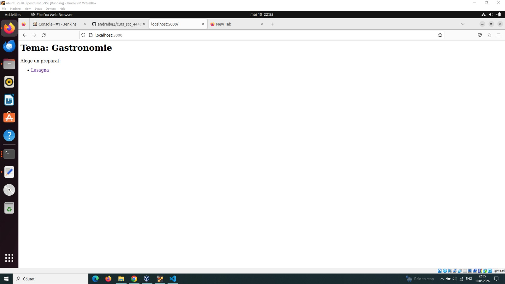
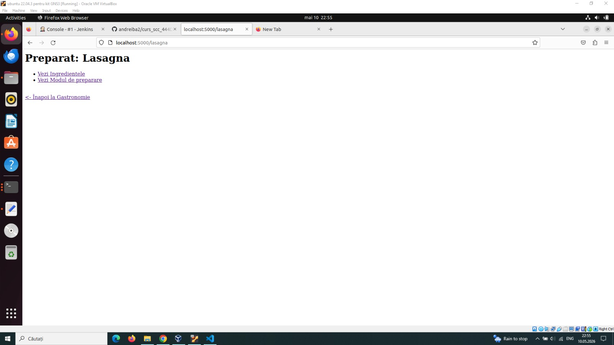
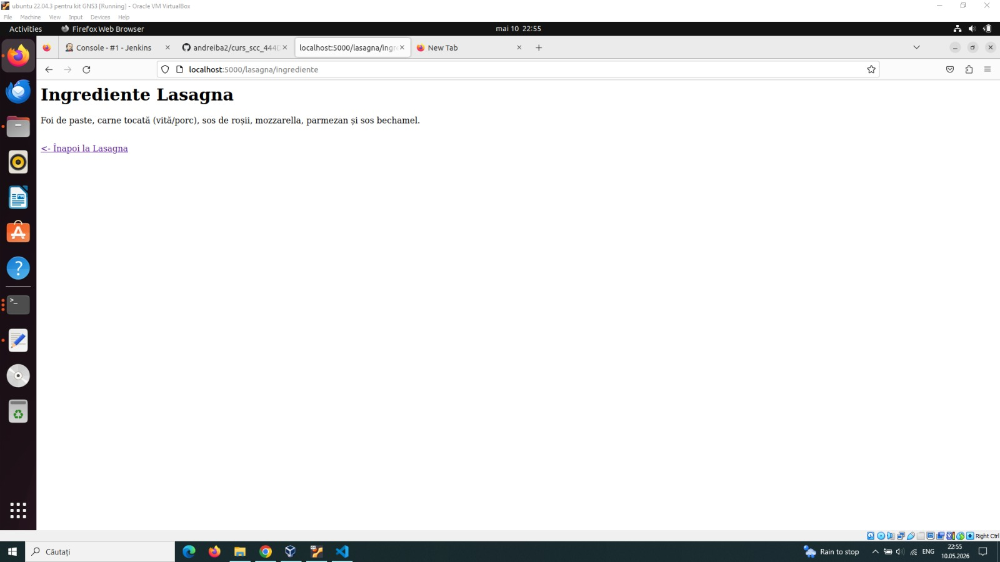
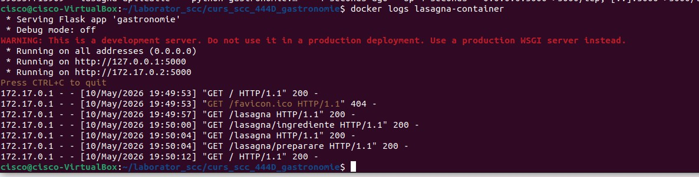

# Proiect VCGJ - Gastronomie: Lasagna
**Dezvoltator:** Konya Andra-Maria
**ID Dezvoltator:** andrakonya16

## 1. Funcționalitate adăugată
Am implementat funcționalitatea pentru preparatul **Lasagna** în cadrul temei de Gastronomie. Aceasta include:
* O bibliotecă Python situată în `app/lib/biblioteca_gastronomie.py` cu funcții pentru ingrediente și mod de preparare.
* Rute dedicate în aplicația principală `gastronomie.py` pentru vizualizarea acestor informații în browser.

## 2. Stadiul implementării
- [x] Codul sursă a fost adăugat în repository pe branch-ul de dezvoltare.
- [x] Structura de directoare respectă cerințele (`app/lib/`).
- [x] Aplicația WEB rulează și funcționalitatea poate fi accesată din browser.

## 3. Testarea aplicației
Testarea a fost realizată atât manual, cât și automat:
* **Testare manuală:** Verificarea fiecărei rute direct în browser.
* **Testare automată:** Utilizarea `unit-test`-elor în Python (fișierul `test_gastronomie.py`).
* **Jenkins:** Fișierul `Jenkinsfile` este configurat pentru a rula testele automat la fiecare build. Testele trec cu succes (Rezultat: **PASS**).

## 4. Integrare și Cod Review
* **Status PR:** Codul a fost integrat cu succes din branch-ul `dev_konya_andra` în `main_konya_andra`. Fişierul README.md a fost integrat în branch-ul `main` al grupei.
* **Review-uri efectuate:** Am efectuat cod review pentru următoarele Pull Request-uri ale colegilor:
    * PR ID # [Introduceți ID-ul aici] - [Nume Coleg]

## 5. Containerizare (Docker)
Aplicația a fost containerizată folosind un `Dockerfile`. Containerul include toată funcționalitatea necesară pentru preparatul Lasagna și rulează cu succes.

### Dovezi execuție container:
1. **Imaginea de container creată:**  
2. **Containerul creat și rulând:**  
3. **Browserul accesând aplicația din container:** 
 
 
 
4. **Consola cu mesajele de log ale aplicației:**  

## 6. Stare finală
- [x] Proiect finalizat cu succes și toate cerințele din documentație îndeplinite. Documentația este disponibilă în branch-ul de dezvoltare și în cel main.
