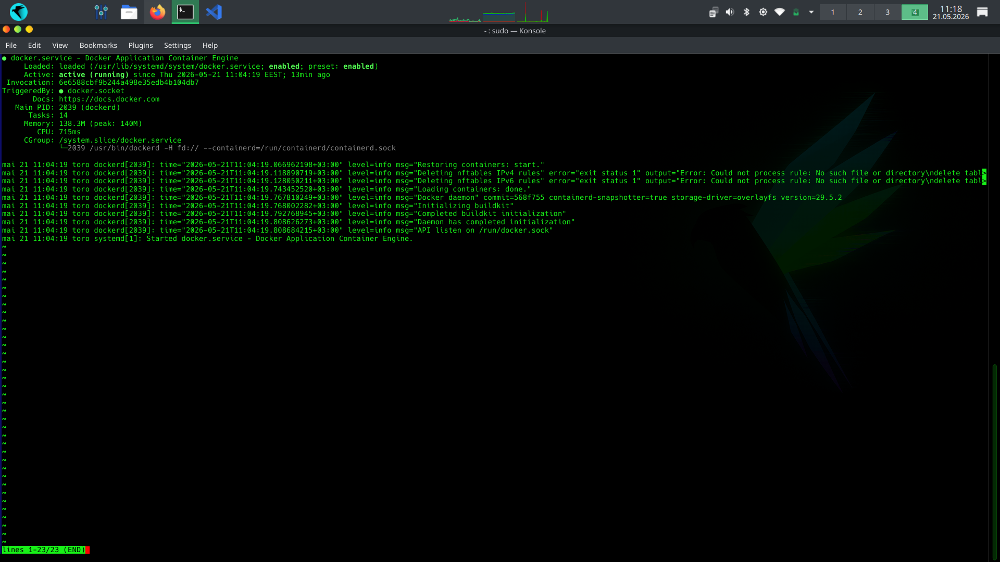
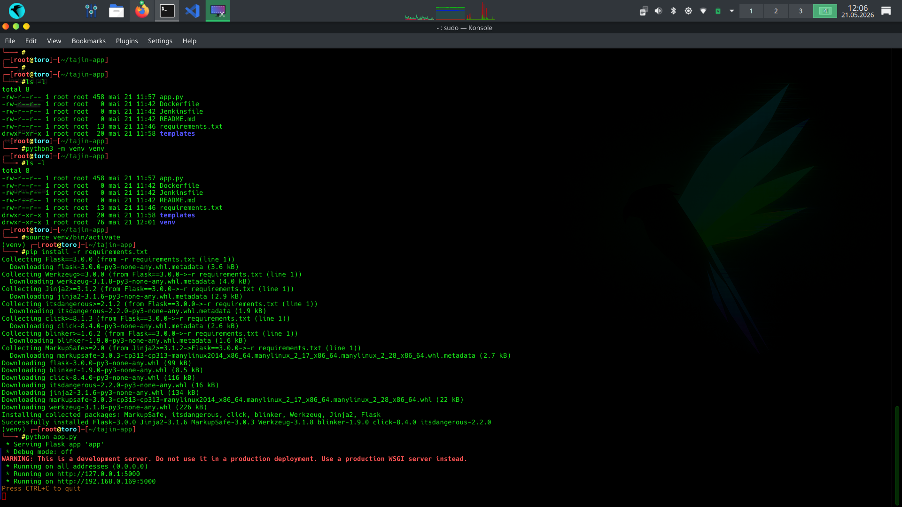
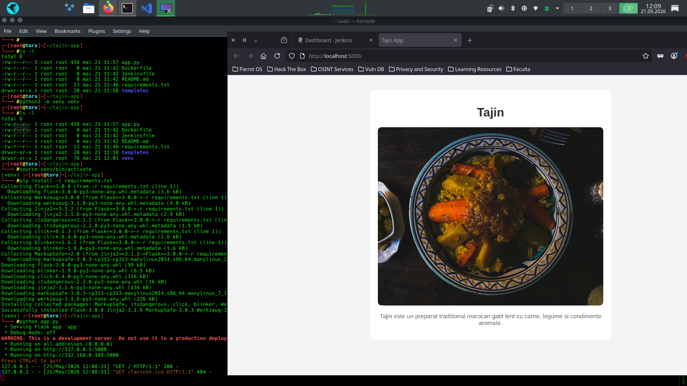
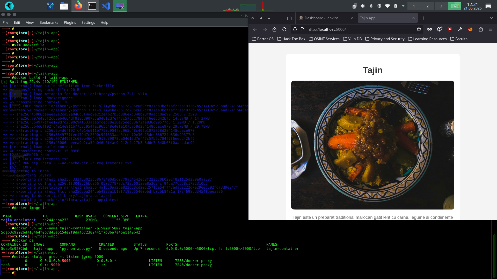
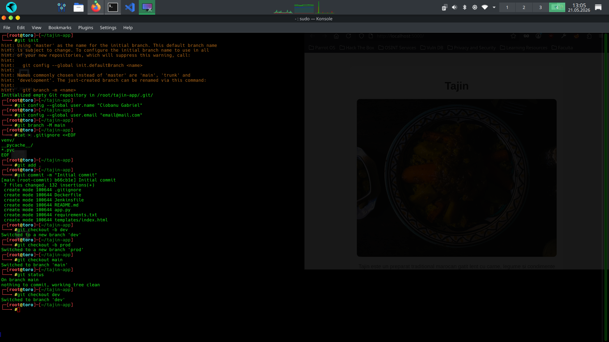
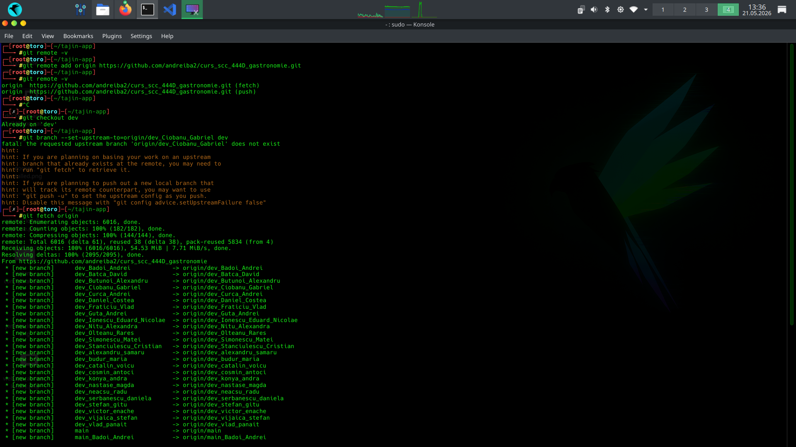
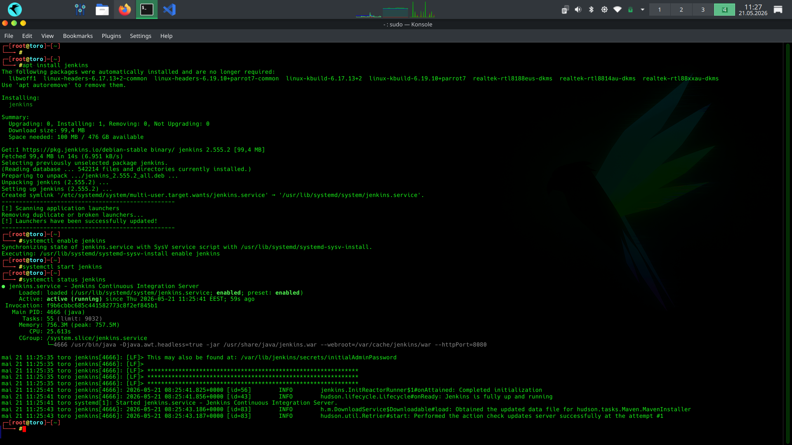
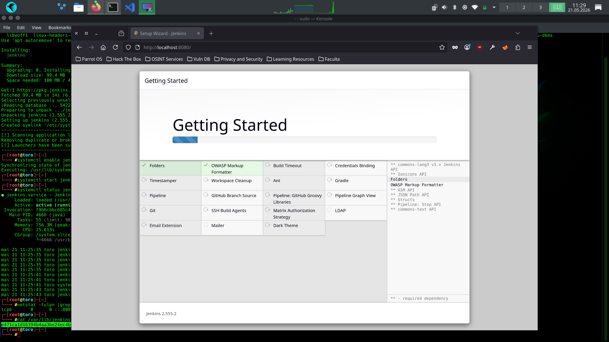
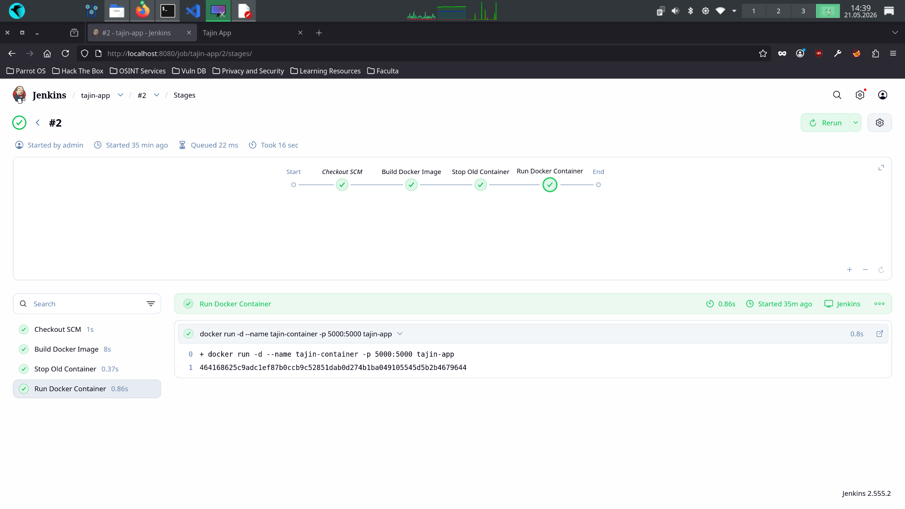
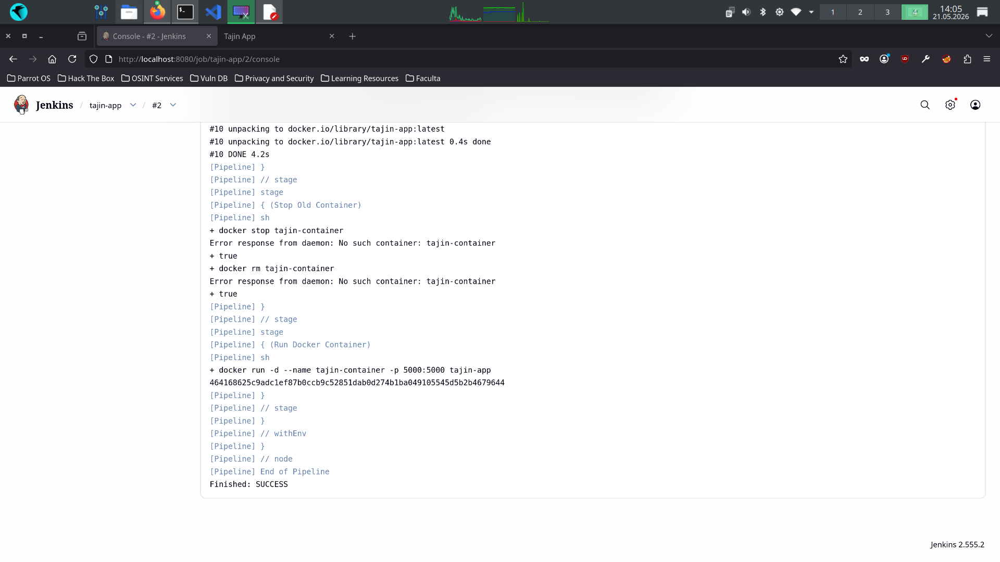

# Tajin Flask Docker CI/CD Project
#Student: Ciobanu Gabriel        Grupa: 444D

## Descriere

Acest proiect reprezintă o aplicație web minimală realizată în Python Flask, containerizată folosind Docker și automatizată prin Jenkins Pipeline.

---

# Stage 1 — Instalare Docker

În această etapă a fost instalat și pornit serviciul Docker pe sistemul Parrot OS.

Comenzi utilizate:

```bash
apt install docker.io
systemctl enable docker
systemctl start docker
systemctl status docker
```

Imagine Docker service activ:



---

# Stage 2 — Configurare aplicație Flask local

A fost creată aplicația Flask folosind:
- app.py
- templates/index.html
- requirements.txt

A fost creat mediul virtual Python:

```bash
python3 -m venv venv
source venv/bin/activate
```

Instalare dependințe:

```bash
pip install -r requirements.txt
```

Rulare aplicație local:

```bash
python app.py
```

Imagine rulare Flask local:



---

# Stage 3 — Accesare aplicație web local

După pornirea aplicației Flask, aceasta poate fi accesată în browser la:

```text
http://localhost:5000
```

Imagine aplicație web:



---

# Stage 4 — Containerizare Docker

Aplicația a fost containerizată folosind Docker.

Build imagine Docker:

```bash
docker build -t tajin-app .
```

Pornire container:

```bash
docker run -d --name tajin-container -p 5000:5000 tajin-app
```

Verificare containere:

```bash
docker ps
docker image ls
```

Imagine build și rulare container:



---

# Stage 5 — Inițializare Git local

Repository-ul Git a fost inițializat local.

Comenzi utilizate:

```bash
git init
git branch -M main
```

Creare branch-uri:

```bash
git checkout -b dev
git checkout -b prod
```

Commit inițial:

```bash
git add .
git commit -m "Initial commit"
```

Imagine inițializare Git:



---

# Stage 6 — Configurare GitHub Remote

Repository-ul local a fost conectat la repository-ul GitHub al grupei.

Adăugare remote:

```bash
git remote add origin https://github.com/andreiba2/curs_scc_444D_gastronomie.git
```

Fetch branch-uri remote:

```bash
git fetch origin
```

Imagine configurare remote:



---

# Stage 7 — Instalare Jenkins

A fost instalat și pornit Jenkins local.

Comenzi utilizate:

```bash
apt install jenkins
systemctl enable jenkins
systemctl start jenkins
systemctl status jenkins
```

Acces Jenkins:

```text
http://localhost:8080
```

Imagine instalare Jenkins:



---

# Stage 8 — Configurare Jenkins Plugins&Pipeline

A fost creat un job Jenkins de tip Pipeline folosind fișierul:

```text
Jenkinsfile
```

Pipeline-ul execută:
- build Docker image
- stop container vechi
- remove container vechi
- run container nou

Imagine configurare Jenkins Pipeline:



---

# Stage 9 — Rulare Jenkins Pipeline

Pipeline-ul Jenkins rulează automat procesul de deployment.

Acesta:
- face checkout din GitHub
- construiește imaginea Docker
- recreează containerul
- pornește aplicația actualizată

Rezultat final:

```text
Finished: SUCCESS
```

Imagine pipeline executat cu succes:



---

# Workflow Git utilizat

Development branch:

```text
dev -> dev_Ciobanu_Gabriel
```

Production branch:

```text
prod -> main_Ciobanu_Gabriel
```

Flux utilizat:
1. dezvoltare pe branch-ul dev
2. validare prin Jenkins
3. merge în prod
4. push către main remote

---

# Rezultat Final

Proiectul demonstrează:
- dezvoltare Flask locală
- containerizare Docker
- versionare Git/GitHub
- CI/CD prin Jenkins
- deployment automatizat local
