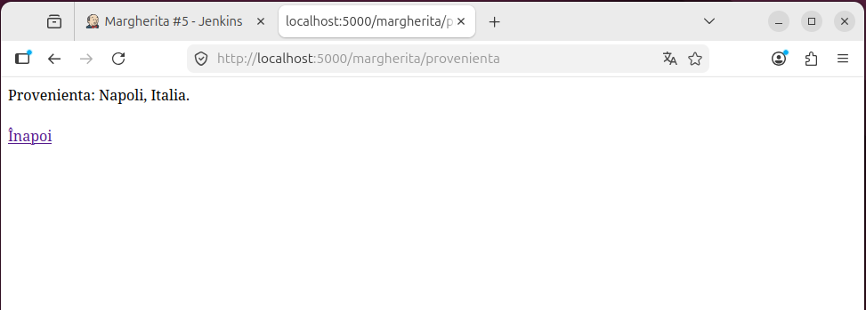
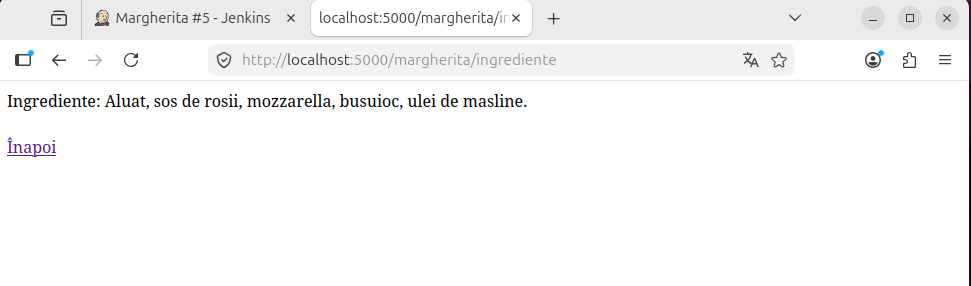
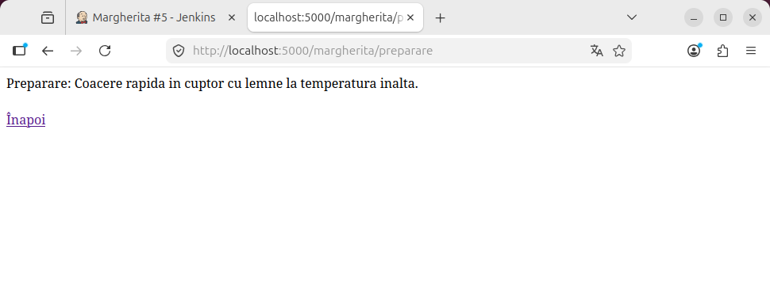

# Proiect SCC - Gastronomie (Margherita)
**Student:** Neacșu Radu-Costin
**Grupa:**444D
**Branch dezvoltare:**dev_neacsu_radu
**Branch principal:** main_neacsu_radu

### 1. Funcționalitate adăugată
- Implementare rute pentru Pizza Margherita: Principală, Proveniență, Ingrediente, Preparare.

### 2. Stadiul implementării
- Codul este complet adăugat în branch-ul de dezvoltare și integrat.

### 3. Testare (Jenkins)
- Testele unitare au fost rulate cu succes folosind un pipeline declarativ.
- Rezultat Jenkins: PASS. Istoricul execuției și pipeline-ul vizual:

### 4. Containerizare (Docker)
Aplicația a fost containerizată și testată:

- **Imaginea creată:** 

- **Containerul creat:** 

- **Mesaje consolă:** 

- **Acces din browser (Paginile aplicației):** *Pagina Principală:*

*Pagina Proveniență:*

*Pagina Ingrediente:*

*Pagina Preparare:*

### 5. Integrare
- PR creat pentru integrarea în main.
- Review-uri: [...].
