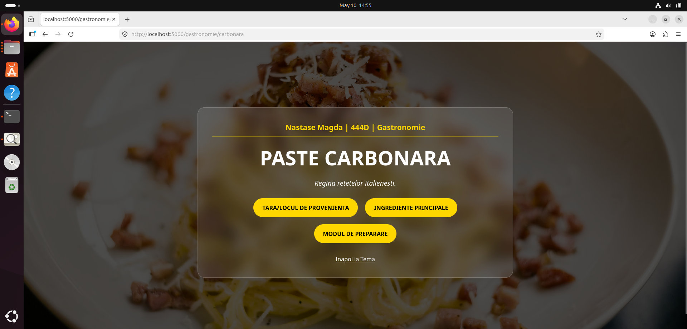
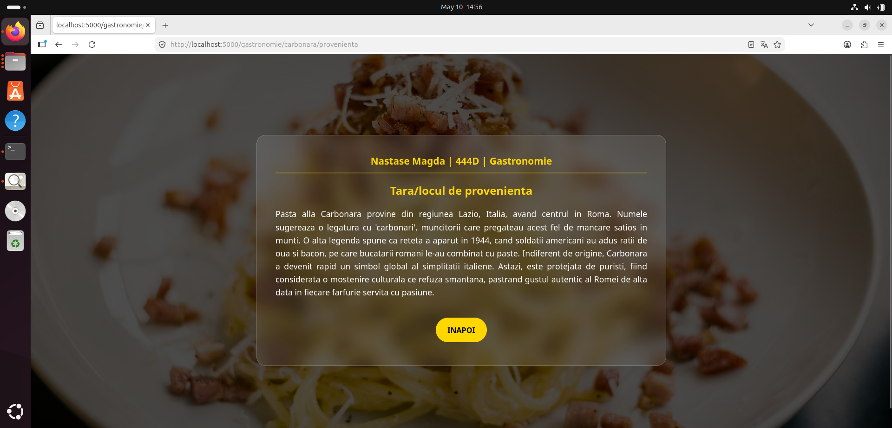
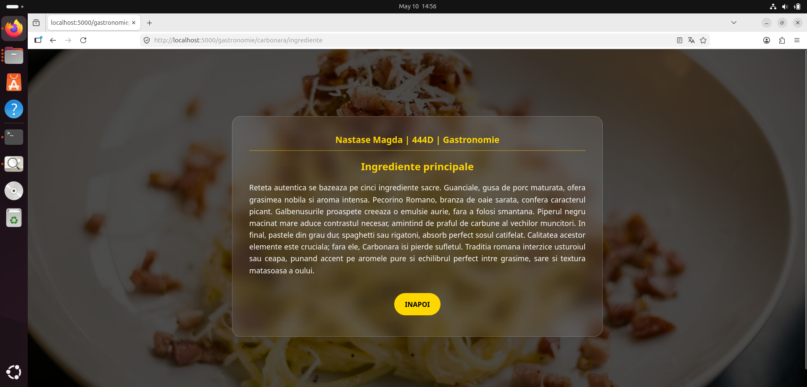
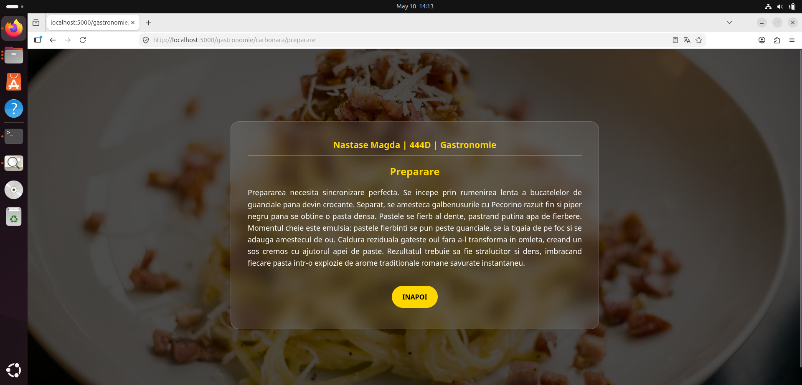

# 🍝 Proiect Gastronomie: Paste Carbonara

**Student:** Năstase Maria-Magdalena  
**Grupă:** 444D  
**Disciplină:** SCC

## Structură Proiect

Fiecare componentă a fost organizată pentru a respecta cerințele de dezvoltare colaborativă și livrare continuă: 

```text
.
├── app/
│   └── lib/
│       ├── __init__.py                # Initializare modul bibliotecă
│       └── biblioteca_gastronomie.py  # Conține funcțiile specifice elementului (Ingrediente, Proveniență) 

├── screenshots/                       # Capturi de ecran (Aplicație/Docker)
├── Dockerfile                         # Configurare imagine Docker
├── Jenkinsfile                        # Pipeline CI/CD Jenkins
├── gastronomie.py                     # Aplicația principală Flask configurată cu cele 4 rute
├── requirements.txt                   # Dependențe Python (Flask)
├── test_gastronomie.py                # Teste unitare și integrare
└── README.md                          # Documentația proiectului
```

## 2. Funcționalitate
Aplicația Flask pentru tema **Gastronomie** se concentrează pe elementul **Paste Carbonara** și include cele **patru rute obligatorii**: 
- **Tema:** `/gastronomie` - Pagina generală de prezentare a temei grupei. 
- **Elementul:** `/gastronomie/carbonara` - Pagina principală dedicată elementului ales. 
- **Caracteristica 1 -> Proveniență:** `/gastronomie/carbonara/provenienta` - Detalii despre originile rețetei. 
- **Caracteristica 2 -> Ingrediente:** `/gastronomie/carbonara/ingrediente` - Lista ingredientelor autentice. 
- **Caracteristica 3 -> Mod de preparare:** `/gastronomie/carbonara/preparare` - Tehnica specifică de gătire.

---

## 3. Stadiul implementării
* **Cod aplicație:** Finalizat și integrat. Rutele și funcțiile din bibliotecă sunt complet funcționale.**Teste unitare:** Implementate în `test_gastronomie.py` și validate local. 
* **Jenkins Pipeline:** Configurat corect; testele sunt executate automat și au statusul **PASS**. 
* **Containerizare:** Proiectul este pregătit de livrare prin Docker; aplicația rulează pe portul **5000**. 
* **Integrare:** Codul a fost integrat în branch-ul `main_nastase_magda` în urma procesului de review. 
* **Ce mai este de făcut:** Proiectul este finalizat conform specificațiilor actuale. 

## 4. Interfața Web (Capturi de ecran)
*Aici sunt prezentate capturile cu interfața grafică dezvoltată:*

### Pagina Principală (Home)


### Structura Rutelor catre Caracteristici


### Detalii Carbonara (Caracteristicile)

Caracteristica 1 -> Provenienta

Caracteristica 2 -> Ingrediente

Caracteristica 3 -> Preparare


---

## 5. Containerizare (Dovezi Docker)
Conform cerințelor de containerizare, am realizat următoarele capturi: 

### Imaginea de container creată
 

### Containerul rulând pe baza imaginii (docker ps)
 

### Browserul accesând aplicația din container
 

### Mesajele afișate în consolă (Log-uri/docker logs)


### Rezultatul rulării testelor cu Jenkins (PASS)


---

## 6. Ghid de Rulare (Docker)
* Pentru a lansa aplicația într-un container izolat, se utilizează următoarele comenzi:

 Construire imagine

* `docker build -t carbonara-app .`

 Lansare container

* `docker run -d -p 5000:5000 --name container_carbonara carbonara-app`

---

## 7. Integrare și Review
Colaborarea a fost realizată prin sistemul de Pull Request pe GitHub: 

* **ID Pull Request Personal:** #69, de pe branch-ul  dev_nastase_magda către main_nastase_magda
* **Aprobare primită:** PR-ul a fost validat de la andreiba2, confirmând calitatea codului. 

---

*Proiect realizat pentru disciplina **Servicii Cloud și Containerizare**, 2026.* 
