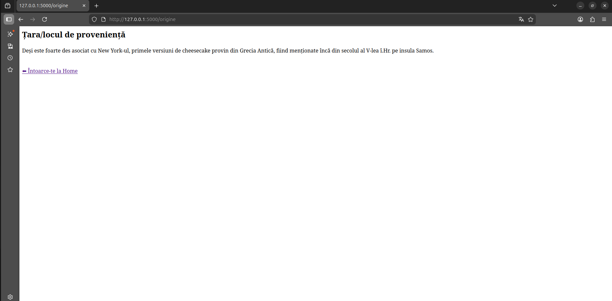
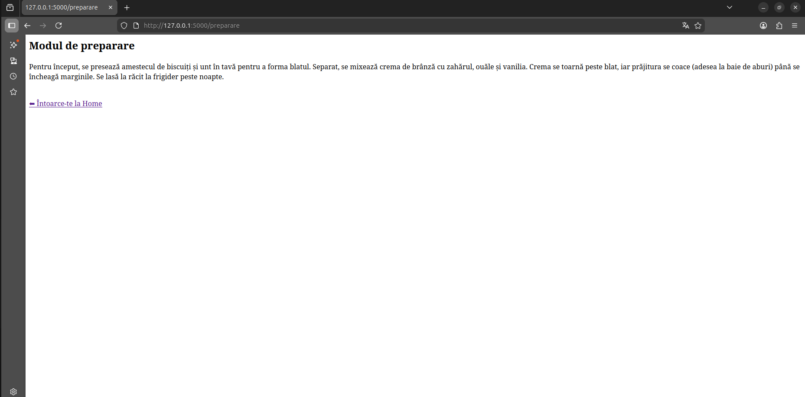

# Proiect SCC - Cheesecake

**Nume student:** Ionescu Eduard-Nicolae
**Tema aleasă:**  Cheesecake

## Descriere aplicație
Acesta este un proiect simplu realizat cu Flask. Aplicația prezintă informații despre Cheesecake și este structurată pe o pagină principală (Home) și 3 sub-pagini (Origine, Ingrediente, Preparare), având link-uri pentru a naviga ușor între ele.

## Rutele aplicației
Ruta de bază: `http://127.0.0.1:5000`

* **Pagina principală:** `/` - `http://127.0.0.1:5000/`

* **Originea desertului:** `/origine` - `http://127.0.0.1:5000/origine`

* **Ingrediente:** `/ingrediente` - `http://127.0.0.1:5000/ingrediente`

* **Preparare:** `/preparare` - `http://127.0.0.1:5000/preparare`

## Testare cu Pytest și Pylint
Am scris teste de tip unit test cu `pytest` pentru funcțiile care returnează textul din aplicație. De asemenea, am folosit `pylint` pentru a verifica la final calitatea codului din fișierul principal.

**Rezultat pytest:**

**Rezultat pylint:**

 
## Docker
Aplicația a fost containerizată.. Imaginea se construiește cu succes, iar containerul rulează și expune portul 5000.

**Vizualizare container activ:**
 .
