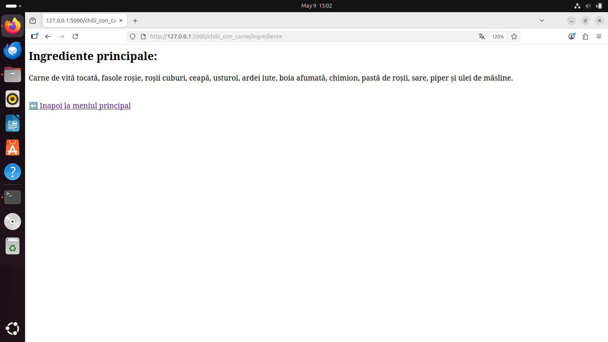
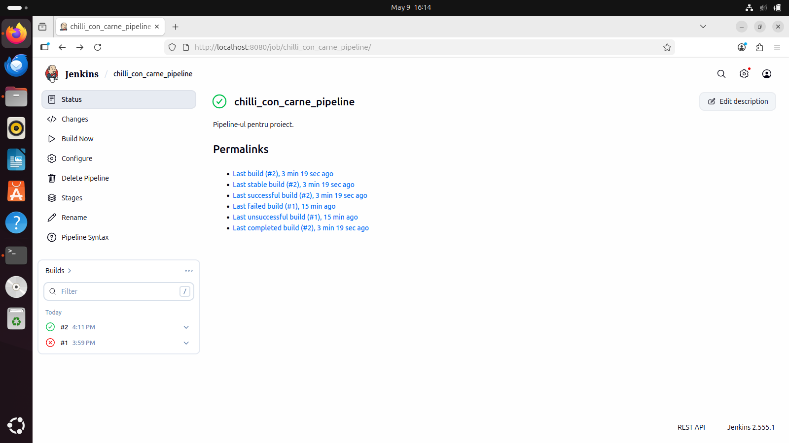
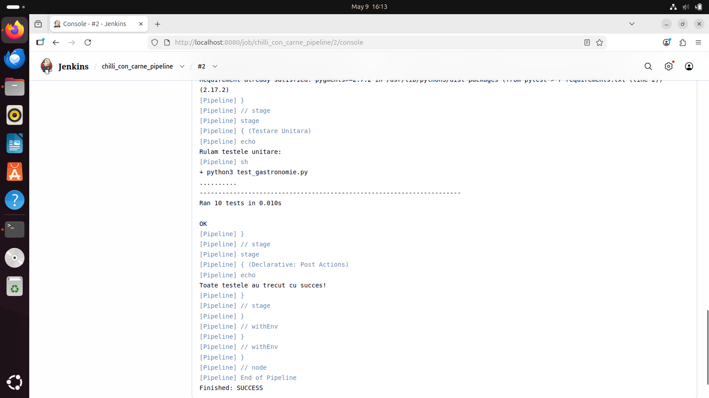
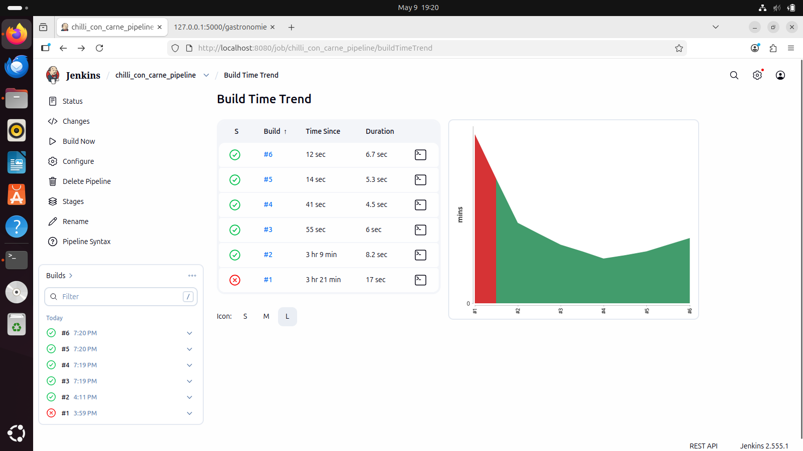

# Proiect Gastronomie: Chilli con carne

**Student:** Antoci George-Cosmin  
**Grupă:** 444D

## Structură Proiect

```text
.
├── app/
│   └── lib/
│       ├── __init__.py
│       └── biblioteca_gastronomie.py   # Functii pentru Chilli con carne
├── screenshots/                         # Capturi de ecran
├── Dockerfile                           # Configurare Docker
├── Jenkinsfile                          # Pipeline Jenkins
├── gastronomie.py                       # Aplicatia Flask
├── requirements.txt                     # Dependente
├── test_gastronomie.py                  # Teste unitare
└── README.md                            # Documentatia
```

## 1. Functionalitate

Am implementat o aplicatie Flask pentru tema Gastronomie, axata pe Chilli con carne. Aplicatia are rute pentru:
- Provenienta: de unde vine preparatul (Tex-Mex, Texas)
- Ingrediente: lista cu ingredientele principale
- Mod de preparare: pasii pentru a gati

## 2. Stadiul implementarii

- Cod aplicatie: Finalizat.
- Teste unitare: 10 teste implementate in `test_gastronomie.py`.
- Jenkins Pipeline: Configurat si functional.
- Containerizare: Dockerfile creat, imagine construita si testata.

## 3. Testare

### Testare manuala

Aplicatia a fost testata manual din browser, accesand toate rutele si verificand ca informatiile se afiseaza corect.




### Testare cu Jenkins

Am configurat un Jenkinsfile cu 3 stage-uri (verificare fisiere, instalare dependinte, testare unitara). Toate cele 10 teste trec cu succes.






## 4. Containerizare

Am creat un Dockerfile bazat pe `python:3.12-slim` care instaleaza dependintele si porneste aplicatia pe portul 5000.


## 5. Integrare

- PR de la `dev_cosmin_antoci` la `main_cosmin_antoci`: in asteptare creare.
- PR de la `main_cosmin_antoci` la `main`: in asteptare creare si review de la un coleg.

## 6. Ce mai e de facut

- [ ] Crearea PR-ului de la `dev_cosmin_antoci` la `main_cosmin_antoci`
- [ ] Crearea PR-ului de la `main_cosmin_antoci` la `main`
- [ ] Obtinerea unui review aprobat de la un coleg de grupa
- [ ] Integrarea README-ului in branch-ul `main` al grupei
