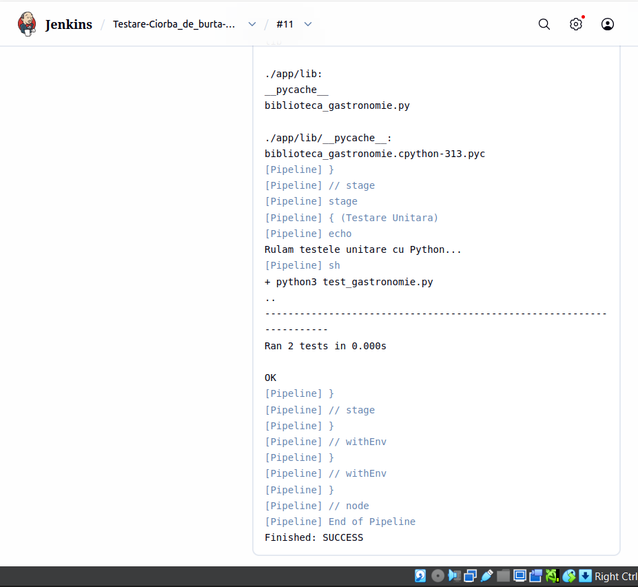

# Proiect VCGJ - Gastronomie: Ciorba de burta
**Student:** Vijaica Stefan
**Grupă:** 444D

## Structură Proiect

```text
.
├── app/
│   └── lib/
│       ├── __init__.py
│       └── biblioteca_gastronomie.py  # Logica pentru Ciorba de burta
├── imagini/                          # Capturi de ecran (screenshots)
├── Dockerfile                        # Configurare imagine Docker
├── Jenkinsfile                       # Pipeline CI/CD pentru Jenkins
├── gastronomie.py                    # Aplicația principală Flask
├── requirements.txt                  # Dependențe Python (Flask)
├── test_gastronomie.py               # Teste unitare (Unittest)
└── README.md                         # Documentația proiectului

```

## 1. Funcționalitate
Am implementat o aplicație Flask pentru tema Gastronomie, axată pe Ciorba de burta. 
Interfața este interactivă și conține rute pentru:
* Proveniență 
* Ingrediente 
* Mod de preparare 

## 2. Stadiul implementării
* **Cod aplicație:** Finalizat
* **Teste unitare:** Implementate în `test_gastronomie.py` 
* **Jenkins Pipeline:** Configurat și funcțional (Rezultat: PASS) 
* **Containerizare:** Dockerfile creat și testat 

## 3. Containerizare (Capturi de ecran obligatorii)
### Imaginea de container creată


### Containerul creat pe baza imaginii 


### Browserul accesând aplicația din container 


### Mesaje consolă (Log-uri apeluri) 


### Build Time Trend


