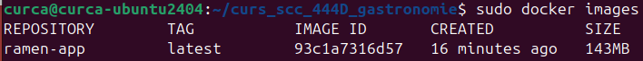
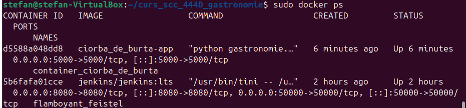
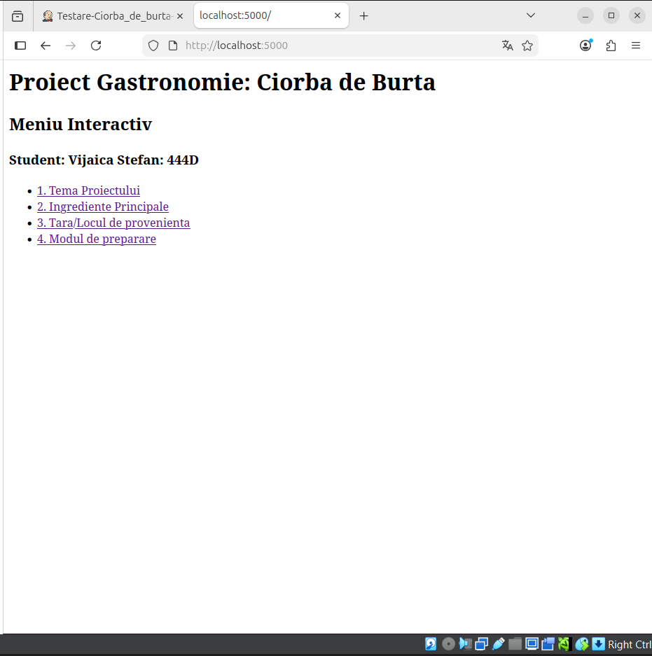
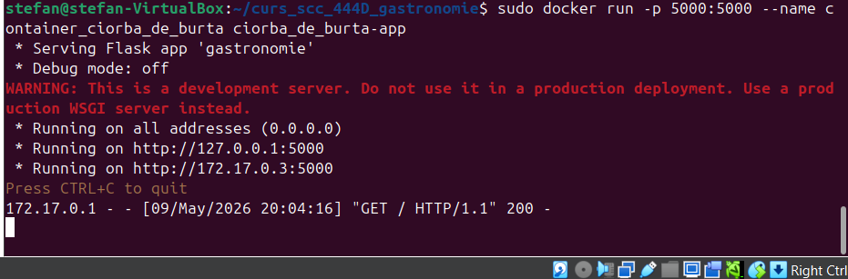
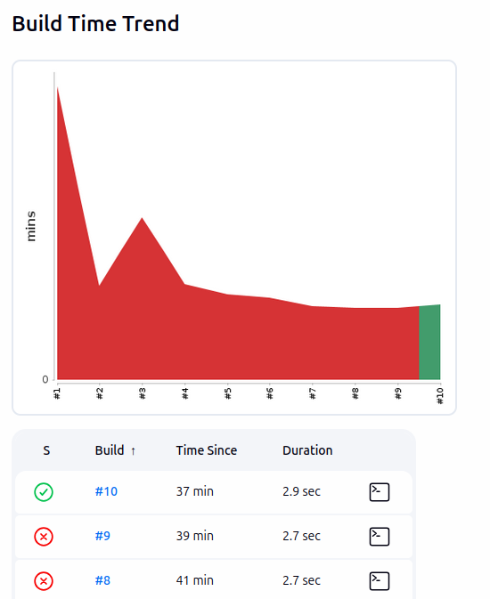
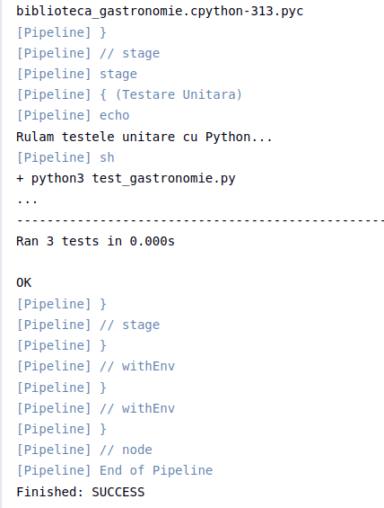
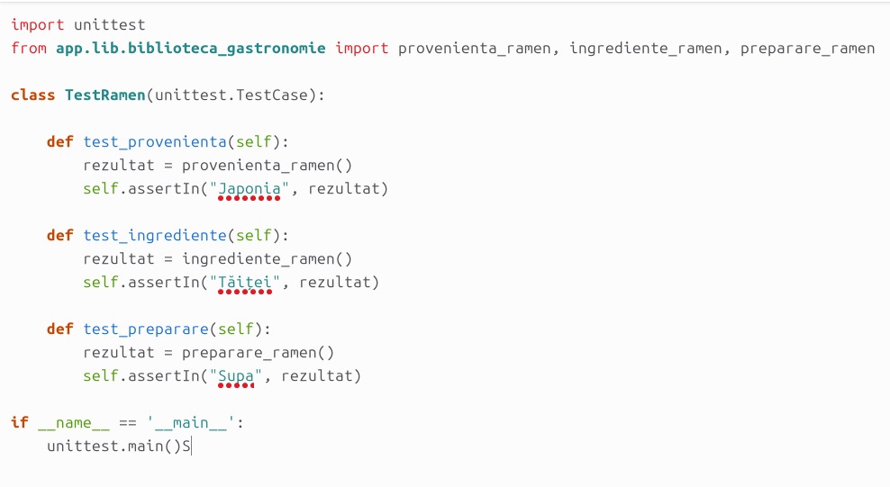

# Proiect Gastronomie: Ramen
**Student:** Curca Andrei-Daniel  
**Grupă:** 444D

## Structură Proiect
```text
.
├── app/
│   └── lib/
│       ├── __init__.py
│       └── biblioteca_gastronomie.py  # Logica pentru Ramen
├── screenshots/                      # Capturi de ecran
├── Dockerfile                        # Configurare Docker
├── Jenkinsfile                       # Pipeline CI/CD
├── gastronomie.py                    # Aplicația Flask
├── requirements.txt                  # Dependențe
├── test_gastronomie.py               # Teste unitare
└── README.md                         # Documentația

```

## 1. Funcționalitate
Am implementat o aplicație Flask pentru tema Gastronomie, axată pe Ramen. Interfața este interactivă și conține rute pentru:
- **Tema și Elementul (Ramen):** Meniul principal și pagina specifică preparatului.
- **Proveniență:** Detalii despre originile preparatului.
- **Ingrediente:** Listarea componentelor principale.
- **Mod de preparare:** Descrierea procesului de gătire.

## 2. Stadiul implementării
- **Cod aplicație:** Finalizat. Rutele și funcțiile au fost implementate cu succes.
- **Teste unitare:** Implementate în `test_gastronomie.py` (validate local).
- **Jenkins Pipeline:** Configurat și funcțional în totalitate. Testele trec cu statusul PASS.
- **Containerizare:** Fișier `Dockerfile` creat, imagine construită și testată.
- **Integrare:** Codul a fost împins pe branch-ul `dev_Curca_Andrei`. Pull Request-ul către `main_Curca_Andrei` a fost creat și se așteaptă review și aprobare de la un coleg.
- **Review-uri acordate:** Pull Request deschis (ID PR: N/A momentan).

## 3. Ce mai este de făcut
Proiectul este considerat finalizat conform cerințelor.

## 4. Containerizare














<<<<<<< HEAD

=======
>>>>>>> 11ebbb56ef447a21a8682130d3965a83a64e8be2
