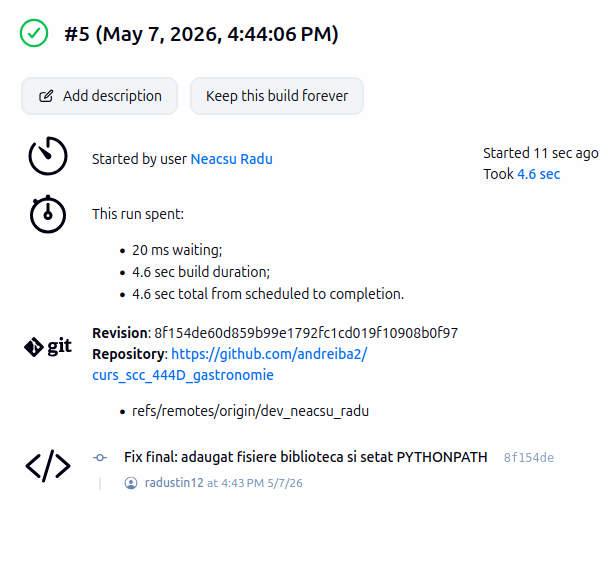
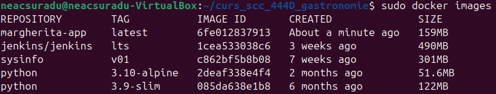
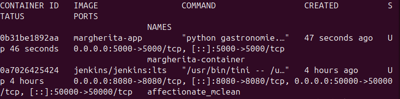
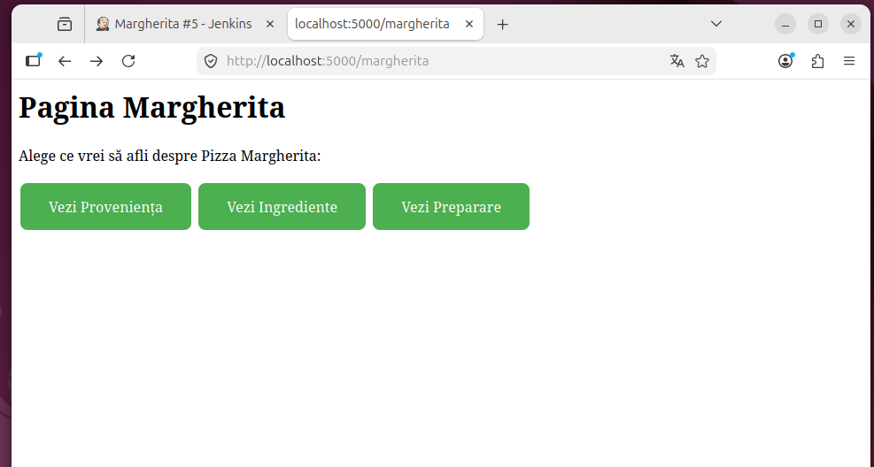
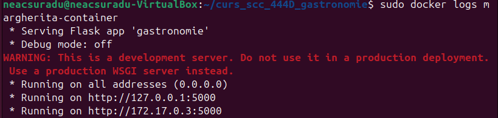

# Proiect SCC - Gastronomie (Margherita)
**Dezvoltator:** Neacșu Radu-Costin

### 1. Funcționalitate adăugată
- Implementare rute pentru Pizza Margherita: Principală, Proveniență, Ingrediente, Preparare.

### 2. Stadiul implementării
- Codul este complet adăugat în branch-ul de dezvoltare și integrat.

### 3. Testare (Jenkins)
- Testele unitare au fost rulate cu succes folosind un pipeline declarativ.
- Rezultat Jenkins: PASS.

### 4. Containerizare (Docker)
Aplicația a fost containerizată și testată. Dovezi:
- Imaginea creată: 
- Containerul creat: 
- Acces din browser: 
- Mesaje consolă: 

### 5. Integrare
- PR creat pentru integrarea în main.
- Review-uri: [...].
