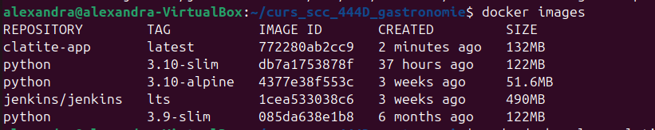
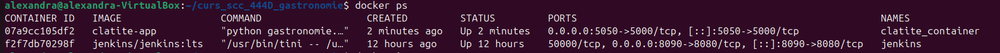
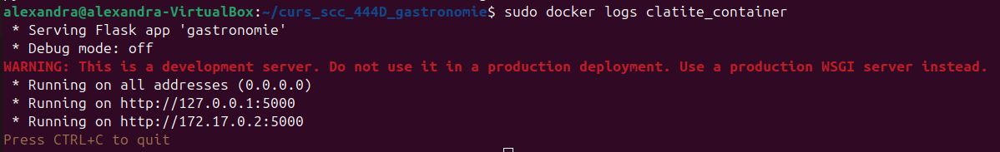
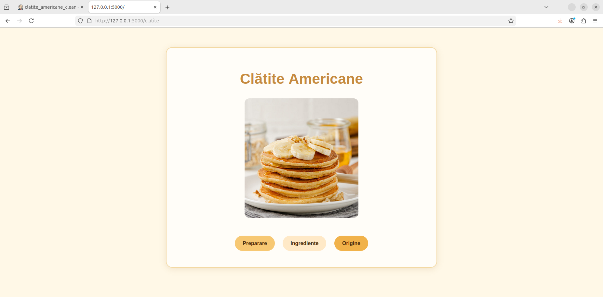
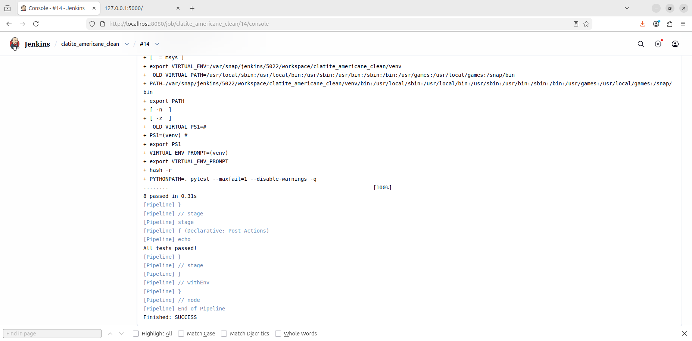

🍽️ Proiect Gastronomie – Clătite Americane
---

## 1) Funcționalitate
- Funcții implementate în `app/lib/biblioteca_gastronomie.py`:
  - [ingrediente_clatite](ca://s?q=Arata_functia_ingrediente_clatite) — returnează lista ingredientelor necesare pentru preparat.
  - [descriere_clatite](ca://s?q=Arata_functia_descriere_clatite) — oferă o scurtă prezentare a clătitelor americane.
- Rute Flask implementate în `clatite.py`:
  - `/clatite` — pagina principală a temei gastronomice
  - `/origine` — prezintă originea clătitelor americane
  - `/ingrediente` — afișează ingredientele folosite
  - `/preparare` — descrie pașii de preparare
- Interfață: design simplu, culori calde și o imagine reprezentativă cu clătite americane.

---

## 2) Stadiul implementării
- Codul complet este disponibil în branch-ul de dezvoltare `dev_Nitu_Alexandra`.

---

## 3) Testare
- Framework utilizat: **pytest**
- Locație teste: folderul `tests/`
- Status: **Toate testele au trecut cu succes** în pipeline-ul Jenkins.

---

## 4) Integrare
- Pull Request deschis din `dev_Nitu_Alexandra` către `main_Nitu_Alexandra`.

---

## 5) Containerizare
- Imaginea creată
- 

- Containerul creat 

- Mesaje afișate în consolă (Log-uri)

- Acces din browser: Pagina Principală

- Testele executate folosind Jenkins

---

## 5)  Rulare (Docker)

Construire imagine:
`docker build -t clatite-app .`

Lansare container:
`docker run -d -p 5050:5000 --name clatite_container clatite-app`

---

## 5)  Integrare și Review
Status PR: Integrat în branch-ul dev_Nitu_Alexandra.

