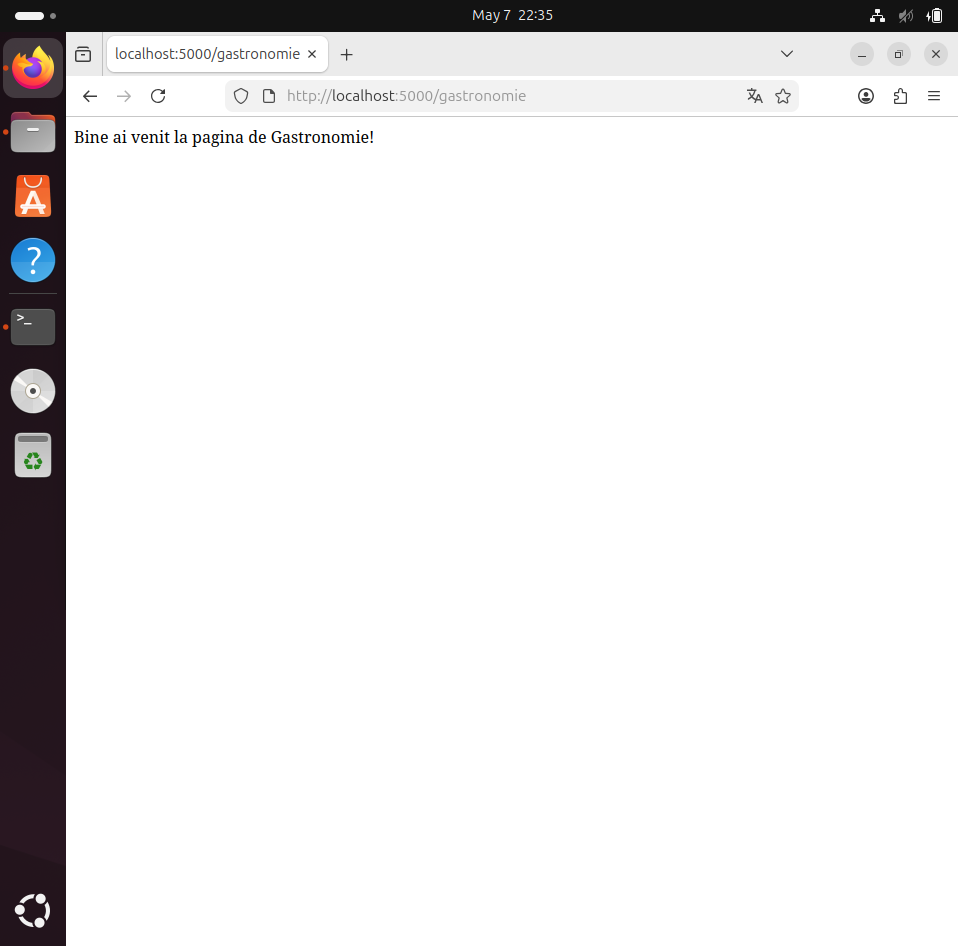
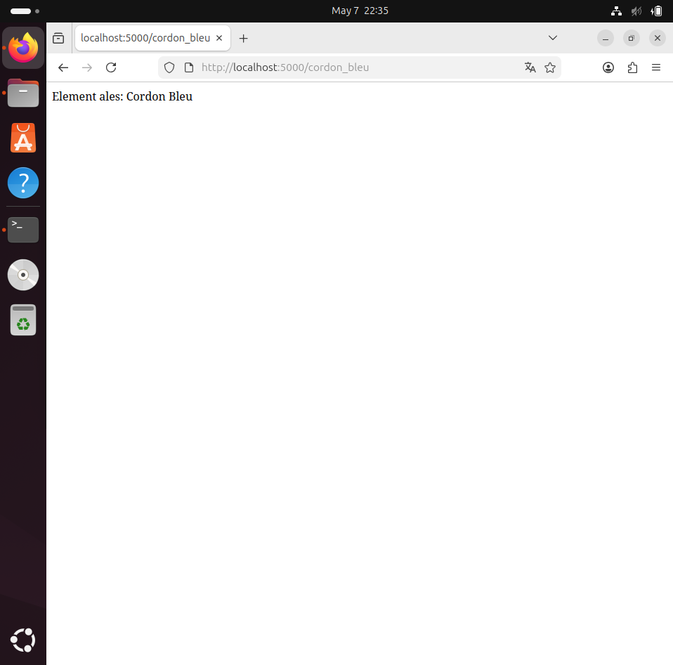
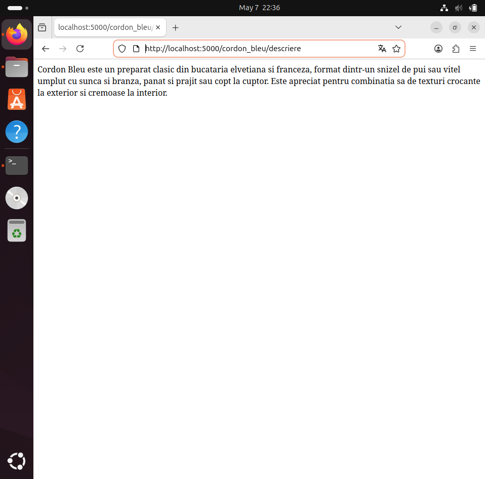
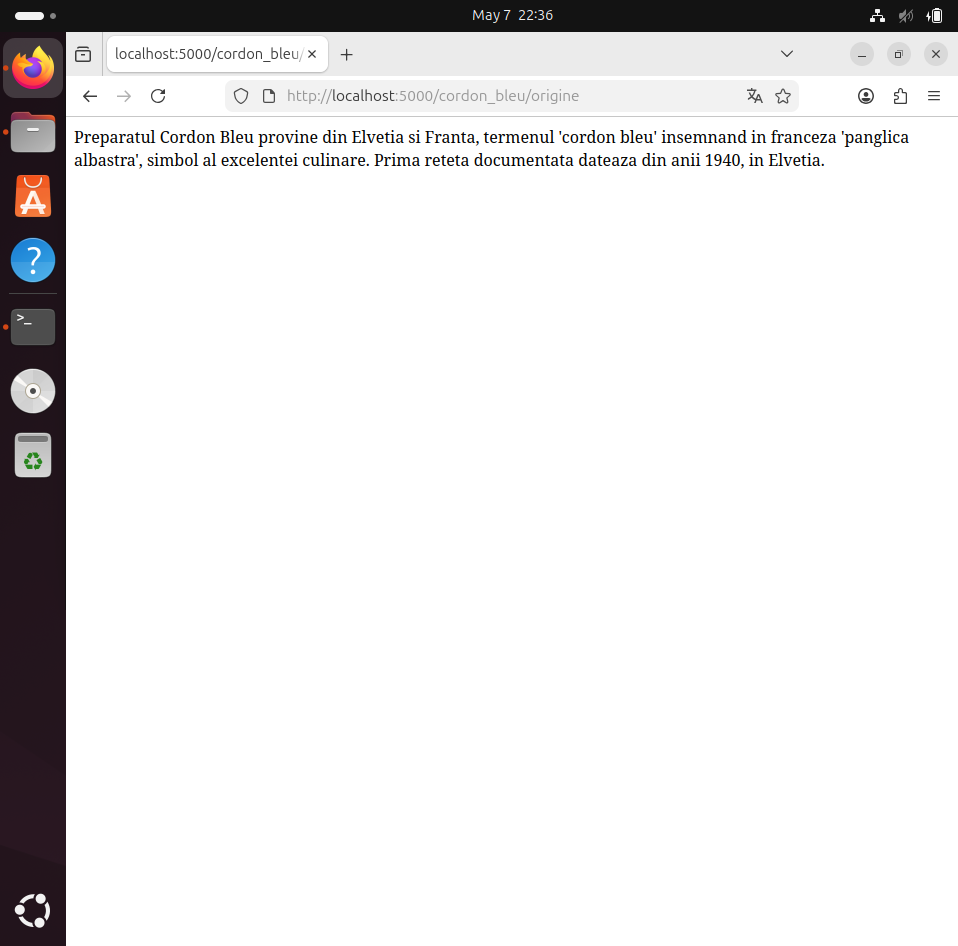
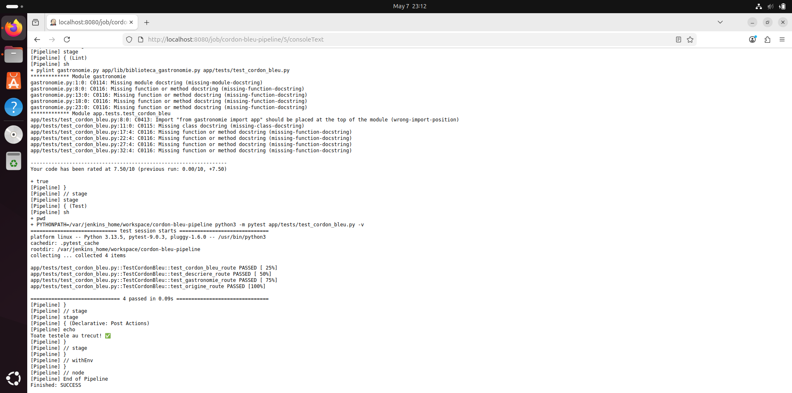

# Proiect SCC 2025 - Cordon Bleu

## Informații generale
- **Tema grupei:** Gastronomie (444D)
- **Element ales:** Cordon Bleu
- **Student:** Stefan Gitu
- **Branch dezvoltare:** dev_stefan_gitu
- **Branch principal:** main_stefan_gitu

## Funcționalitate implementată

| Rută | Descriere |
|---|---|
| `/gastronomie` | Pagina principală |
| `/cordon_bleu` | Elementul ales |
| `/cordon_bleu/descriere` | Descrierea preparatului |
| `/cordon_bleu/origine` | Originea preparatului |

## Screenshot-uri

### Docker - Container pornit

### Browser - Aplicatie rulând

### Jenkins - Teste trecute

