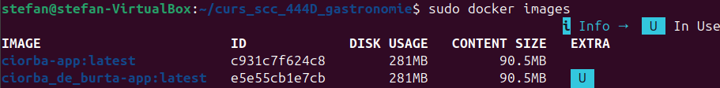
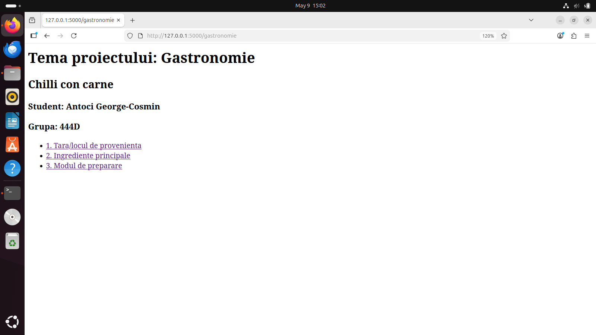
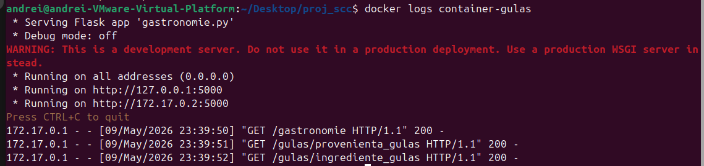

### PROIECT SCC 2026 - 444D

## TEMA: GASTRONOMIE

Bun venit pe README-ul principal al grupei 444D! Mai jos puteți naviga către README-ul fiecărui student al grupei:

1. [Antoci George-Cosmin - Chilli con Carne](#1-antoci-george-cosmin---chilli-con-carne)
2. [Bădoi Andrei-Cristian - Paella](#2-bădoi-andrei-cristian---paella)
3. [Bâtcă David-Andrei - Lava Cake](#3-bâtcă-david-andrei---lava-cake)
4. [Budur Maria - Sushi](#4-budur-maria---sushi)
5. [Butunoi Ioan-Alexandru - Mici](#5-butunoi-ioan-alexandru---mici)
6. [Costea Mihai-Daniel - Brașovence](#6-costea-mihai-daniel---brașovence)
7. [Curcă Andrei-Daniel - Ramen](#7-curcă-andrei-daniel---ramen)
8. [Enache Victor-George - Piftie](#8-enache-victor-george---piftie)
9. [Frăticiu Vlad-Alexandru - Bouyiourdi](#9-frăticiu-vlad-alexandru---bouyiourdi)
10. [Gîtu Ștefan-Teodor - Cordon bleu](#10-gîtu-ștefan-teodor---cordon-bleu)
11. [Guță Andrei-Petrișor - Gulaș](#11-guță-andrei-petrișor---gulaș)
12. [Ionescu Eduard-Nicolae - Cheesecake](#12-ionescu-eduard-nicolae---cheesecake)
13. [Konya Andra-Maria - Lasagna](#13-konya-andra-maria---lasagna)
14. [Năstase Maria-Magdalena - Carbonara](#14-năstase-maria-magdalena---carbonara)
15. [Neacșu Radu-Costin - Margherita](#15-neacșu-radu-costin---margherita)
16. [Nițu Alexandra - Clătite americane](#16-nițu-alexandra---clătite-americane)
17. [Olteanu Rareș-Cristian - Baklava](#17-olteanu-rareș-cristian---baklava)
18. [Panait Vlad-Marian - Tiramisu](#18-panait-vlad-marian---tiramisu)
19. [Popescu Bogdan-Constantin - Tacos](#19-popescu-bogdan-constantin---tacos)
20. [Sămaru Alexandru-Octavian - Salată de boeuf](#20-sămaru-alexandru-octavian---salată-de-boeuf)
21. [Stănciulescu Cristian-Valentin - Ratatouille](#21-stănciulescu-cristian-valentin---ratatouille)
22. [Șerbănescu Daniela-Cristina - Tortilla de patatas](#22-șerbănescu-daniela-cristina---tortilla-de-patatas)
23. [Șimonescu-Diaconu Sebastian-Matei - Pizza](#23-șimonescu-diaconu-sebastian-matei---pizza)
24. [Vîjaică Ștefan - Ciorbă de burtă](#24-vîjaică-ștefan---ciorbă-de-burtă)
25. [Voicu Cătălin-Constantin - Macarons](#25-voicu-cătălin-constantin---macarons)

---

## 1. Antoci G. George-Cosmin - Chilli con Carne
# Proiect Gastronomie: Chilli con carne

**Student:** Antoci George-Cosmin  
**Grupă:** 444D

## Structură Proiect

```text
.
├── app/
│   └── lib/
│       ├── __init__.py
│       └── biblioteca_gastronomie.py   # Functii pentru Chilli con carne
├── screenshots/                         # Capturi de ecran
├── Dockerfile                           # Configurare Docker
├── Jenkinsfile                          # Pipeline Jenkins
├── gastronomie.py                       # Aplicatia Flask
├── requirements.txt                     # Dependente
├── test_gastronomie.py                  # Teste unitare
└── README.md                            # Documentatia
```

## 1. Functionalitate

Am implementat o aplicatie Flask pentru tema Gastronomie, axata pe Chilli con carne. Aplicatia are rute pentru:
- Provenienta: de unde vine preparatul (Tex-Mex, Texas)
- Ingrediente: lista cu ingredientele principale
- Mod de preparare: pasii pentru a gati

## 2. Stadiul implementarii

- Cod aplicatie: Finalizat.
- Teste unitare: 10 teste implementate in `test_gastronomie.py`.
- Jenkins Pipeline: Configurat si functional.
- Containerizare: Dockerfile creat, imagine construita si testata.

## 3. Testare

### Testare manuala

Aplicatia a fost testata manual din browser, accesand toate rutele si verificand ca informatiile se afiseaza corect.

)

)

### Testare cu Jenkins

Am configurat un Jenkinsfile cu 3 stage-uri (verificare fisiere, instalare dependinte, testare unitara). Toate cele 10 teste trec cu succes.

)

)

)
## 4. Containerizare

Am creat un Dockerfile bazat pe `python:3.12-slim` care instaleaza dependintele si porneste aplicatia pe portul 5000.








## 5. Integrare

- PR de la `dev_cosmin_antoci` la `main_cosmin_antoci`: in asteptare creare.
- PR de la `main_cosmin_antoci` la `main`: in asteptare creare si review de la un coleg.

## 6. Pull Request-uri la care am facut review

- PR #31 - "templates/index.html" de la colegul Costea Mihai Daniel (Brasovence) - Approved

## 7. Ce mai e de facut

- [ ] Crearea PR-ului de la `dev_cosmin_antoci` la `main_cosmin_antoci`
- [ ] Crearea PR-ului de la `main_cosmin_antoci` la `main`
- [ ] Obtinerea unui review aprobat de la un coleg de grupa
- [ ] Integrarea README-ului in branch-ul `main` al grupei

---

## 2. Bădoi F.S. Andrei-Cristian - Paella
*(Lipește aici README-ul tău)*
---

## 3. Bâtcă I.E. David-Andrei - Lava Cake
*(Lipește aici README-ul lui David)*
---

## 4. Budur C. Maria - Sushi
*(Lipește aici README-ul Mariei)*
---

## 5. Butunoi I.D. Ioan-Alexandru - Mici
*(Lipește aici README-ul lui Alexandru)*
---

## 6. Costea C. Mihai-Daniel - Brașovence
*(Lipește aici README-ul lui Mihai)*
---

## 7. Curcă D.S. Andrei-Daniel - Ramen
*(Lipește aici README-ul lui Andrei)*
---

## 8. Enache A. Victor-George - Piftie
*(Lipește aici README-ul lui Victor)*
---

## 9. Frăticiu O. Vlad-Alexandru - Bouyiourdi
*(Lipește aici README-ul lui Vlad)*
---

## 10. Gîtu M. Ștefan-Teodor - Cordon bleu
*(Lipește aici README-ul lui Ștefan)*
---

## 11. Guță V.P. Andrei-Petrișor - Gulaș
*(Lipește aici README-ul lui Andrei)*
---

## 12. Ionescu C. Eduard-Nicolae - Cheesecake
*(Lipește aici README-ul lui Eduard)*
---

## 13. Konya A. Andra-Maria - Lasagna
*(Lipește aici README-ul Andrei)*
---

## 14. Năstase I. Maria-Magdalena - Carbonara
*(Lipește aici README-ul Mariei)*
---

## 15. Neacșu D. Radu-Costin - Margherita
*(Lipește aici README-ul lui Radu)*
---

## 16. Nițu S.C. Alexandra - Clătite americane
*(Lipește aici README-ul Alexandrei)*
---

## 17. Olteanu C. Rareș-Cristian - Baklava
*(Lipește aici README-ul lui Rareș)*
---

## 18. Panait M.C. Vlad-Marian - Tiramisu
*(Lipește aici README-ul lui Vlad)*
---

## 19. Popescu C. Bogdan-Constantin - Tacos
*(Lipește aici README-ul lui Bogdan)*
---

## 20. Sămaru M. Alexandru-Octavian - Salată de boeuf
*(Lipește aici README-ul lui Alexandru)*
---

## 21. Stănciulescu C.I. Cristian-Valentin - Ratatouille
*(Lipește aici README-ul lui Cristian)*
---

## 22. Șerbănescu D.C. Daniela-Cristina - Tortilla de patatas
*(Lipește aici README-ul Danielei)*
---

## 23. Șimonescu-Diaconu N. Sebastian-Matei - Pizza
*(Lipește aici README-ul lui Sebastian)*
---

## 24. Vîjaică C. Ștefan - Ciorbă de burtă
*(Lipește aici README-ul lui Ștefan)*
---

## 25. Voicu M.C. Cătălin-Constantin - Macarons
*(Lipește aici README-ul lui Cătălin)*
---
