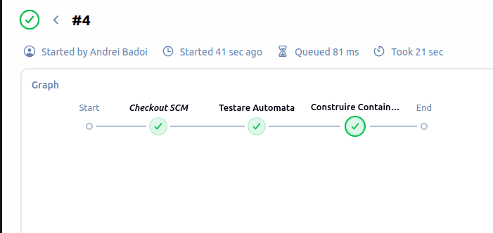
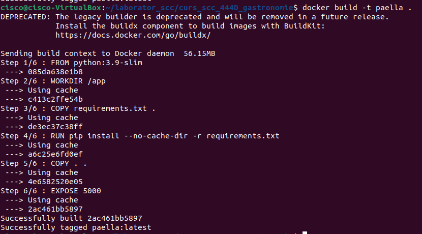
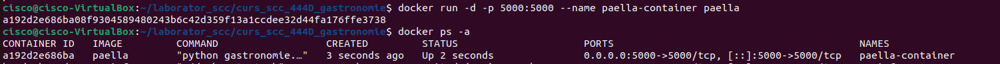
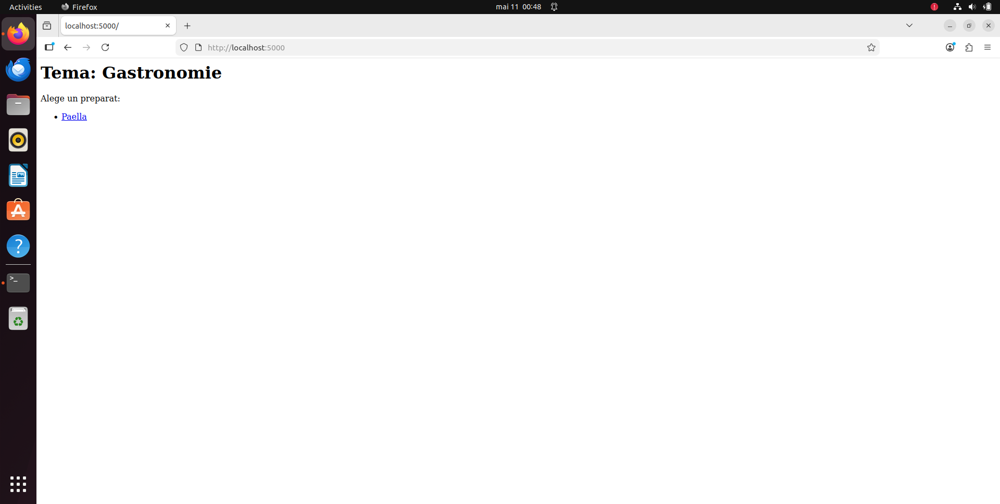
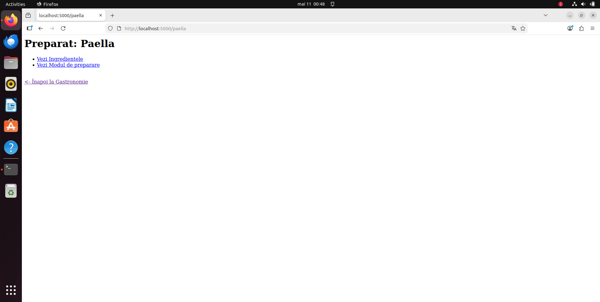
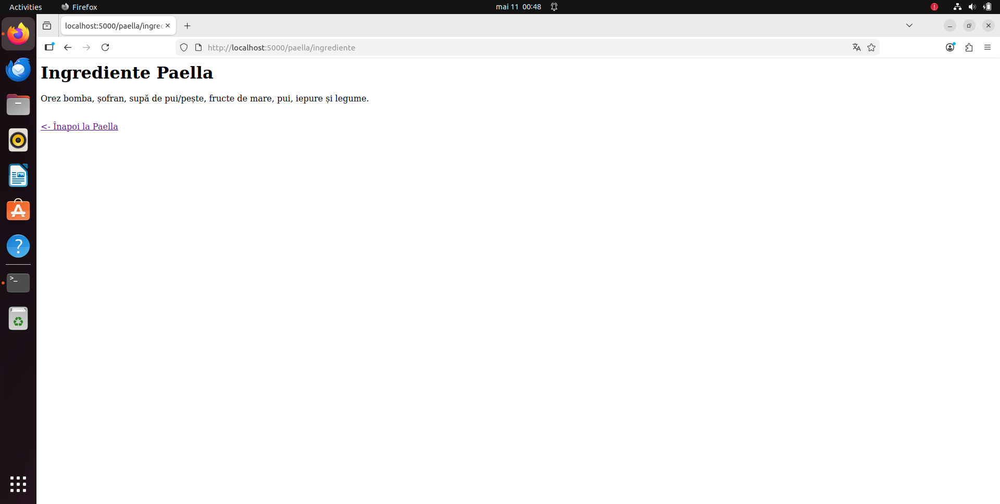
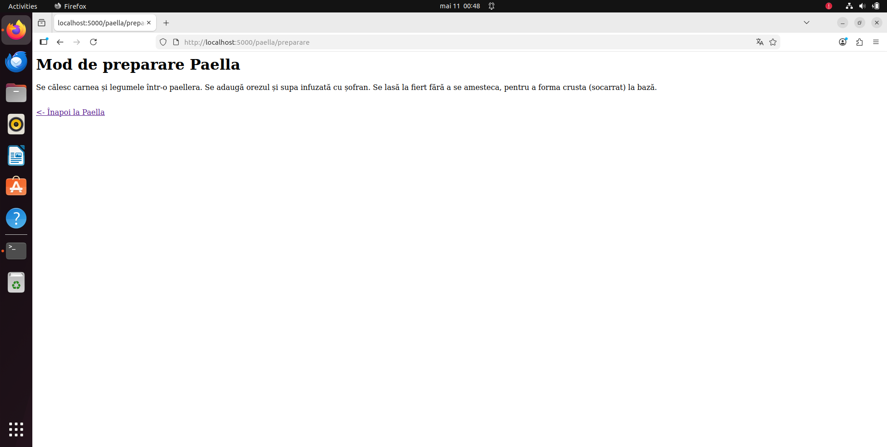
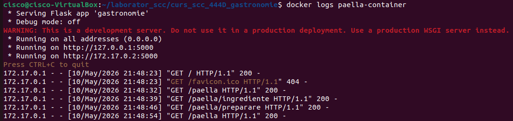

# Proiect VCGJ - Gastronomie: Paella 🥘
**Dezvoltator:** Bădoi Andrei-Cristian
**ID Dezvoltator:** andreiba2
**Grupă:** 444D

---

## 1. Funcționalitate adăugată
Am implementat modulul pentru preparatul **Paella** în cadrul aplicației de gastronomie. Această contribuție include:
* **Logica de business:** Funcții pentru listarea ingredientelor și a pașilor de preparare în `app/lib/biblioteca_gastronomie.py`.
* **Interfața Web:** Endpoint-uri Flask în `gastronomie.py` pentru randarea paginilor specifice.
* **Resurse:** Fișiere `__init__.py` pentru asigurarea structurii de pachete Python.

## 2. Stadiul implementării (Checklist)
- [x] Codul sursă respectă arhitectura proiectului.
- [x] Bibliotecile de funcții sunt documentate și testate.
- [x] Fișierul `requirements.txt` conține toate dependențele (Flask, Pytest).
- [x] Aplicația este containerizată folosind Docker.
- [x] Pipeline-ul de Jenkins este funcțional (Testare -> Build).

## 3. Testarea și Calitatea aplicației (VCGJ)
Validarea funcționalității a fost realizată prin două metode:

* **Testare Automată (Unit Testing):** Am creat scriptul `test_gastronomie.py` care verifică integritatea datelor pentru Paella folosind `pytest`.
* **Automatizare Jenkins:** Proiectul trece prin stadiul de `Testare Automata` în Jenkins. 
  * **Rezultat:** `passed`
  
  

## 4. Dovezi Execuție Container (Docker)
Conform cerințelor, mai jos sunt prezentate dovezile foto ale containerizării:

### A. Imaginea Docker creata

### B. Containerul în rulare

### C. Aplicația în Browser

### D. Log-urile containerului

