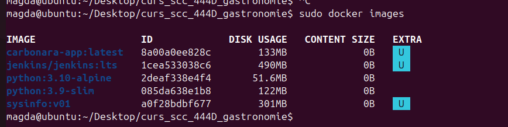
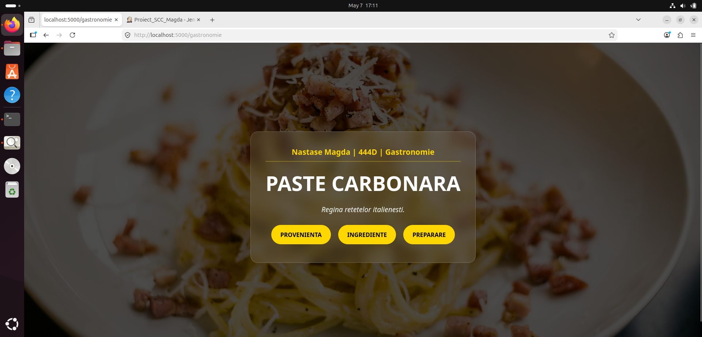
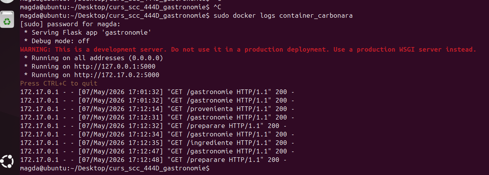
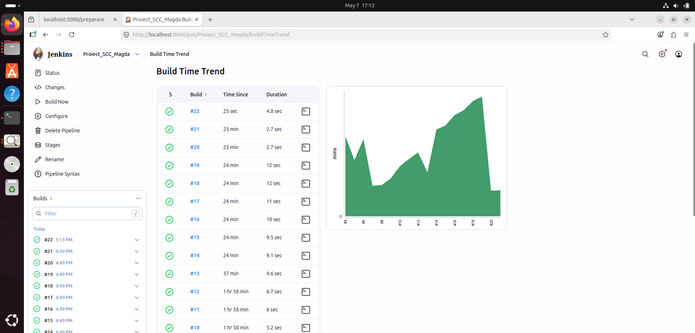

# 🍝 Proiect Gastronomie: Paste Carbonara

**Student:** Năstase Maria-Magdalena  
**Grupă:** 444D  
**Disciplină:** SCC

## Structură Proiect
```text
.
├── app/
│   └── lib/
│       ├── __init__.py                # Initializare modul bibliotecă
│       └── biblioteca_gastronomie.py  # Logica pentru Carbonara (Texte)
├── screenshots/                       # Capturi de ecran (Aplicație/Docker)
├── Dockerfile                         # Configurare imagine Docker
├── Jenkinsfile                        # Pipeline CI/CD Jenkins
├── gastronomie.py                     # Aplicația principală Flask
├── requirements.txt                   # Dependențe Python (Flask)
├── test_gastronomie.py                # Teste unitare și integrare
└── README.md                          # Documentația proiectului
```

## 1. Funcționalitate
Am implementat o aplicație Flask pentru tema Gastronomie, axată pe rețeta de Paste Carbonara. Interfața este interactivă și conține rute pentru:

Proveniență: Detalii despre originile preparatului în regiunea Lazio.

Ingrediente: Listarea componentelor principale (Guanciale, Pecorino, etc.).

Mod de preparare: Descrierea procesului de gătire și a tehnicii emulsiei.

## 2. Stadiul implementării
Cod aplicație: Finalizat și structurat modular.

Teste unitare: Implementate în test_gastronomie.py (validate local și în container).

Jenkins Pipeline: Configurat în Jenkinsfile și funcțional în totalitate.

Containerizare: Fișier Dockerfile creat; imagine construită și testată pe portul 5000.

## 3. Containerizare (Capturi de ecran obligatorii)

### Imaginea de container creată


### Containerul creat pe baza imaginii


### Browserul accesând aplicația din container


### Mesaje afișate în consolă (Log-uri)


### Rezultatul rulării testelor cu Jenkins



## 4. Ghid de Rulare (Docker)
Pentru a lansa aplicația într-un container izolat, se utilizează următoarele comenzi:

 Construire imagine

 
  docker build -t carbonara-app .

 Lansare container
 
 docker run -d -p 5000:5000 --name container_carbonara carbonara-app

## 5. Integrare și Review
Status PR: Integrat în branch-ul dev_nastase_magda.

Testare automată: Validată prin scriptul de test în container.
