# Tortilla de Patatas - Flask App

## Descriere

Această aplicație web a fost realizată folosind Flask și prezintă preparatul tradițional spaniol Tortilla de Patatas.

Aplicația conține:
- pagina principală
- țara de proveniență
- ingredientele principale
- modul de preparare

---

## Tehnologii folosite

- Python
- Flask
- HTML
- CSS
- Docker
- Jenkins
- GitHub

---

## Structura proiectului

```text
app/
 ├── lib/
 ├── templates/
 ├── static/
 ├── tests/
 └── tortilla_de_patatas.py
```

---

## Rulare aplicație

```bash
python3 -m app.tortilla_de_patatas
```

Aplicația rulează pe:

```text
http://127.0.0.1:5050
```

---

## Testare

Teste rulate:

```bash
python3 -m app.tests.tests_app
python3 -m app.tests.tests_lib
```

Rezultat:
- 4 teste pentru aplicație
- 3 teste pentru bibliotecă

---

## Docker

Build imagine:

```bash
docker build -t tortilla-app .
```

Run container:

```bash
docker run -p 5050:5050 tortilla-app
```

---

## Jenkins

Pipeline Jenkins:
- instalare dependențe
- rulare teste
- build Docker

---

## Branch-uri Git

- dev_serbanescu_daniela
- main_serbanescu_daniela

## Screenshot-uri

### Creare folder proiect

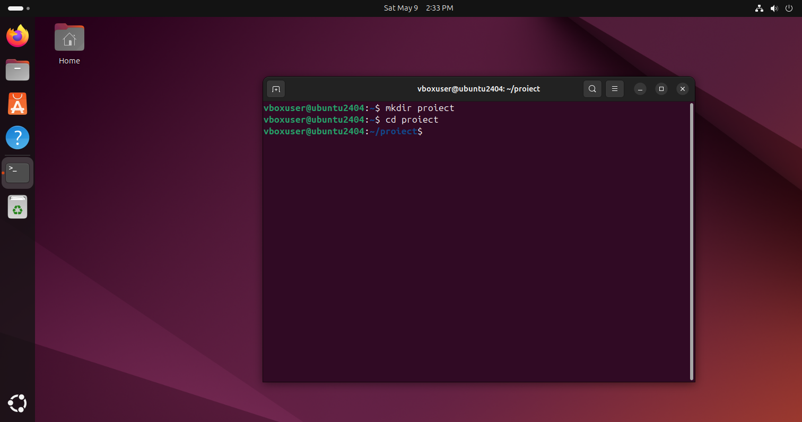

### Clone + venv

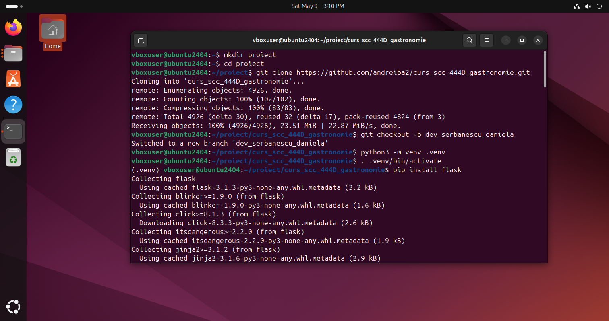

### Instalare pachete

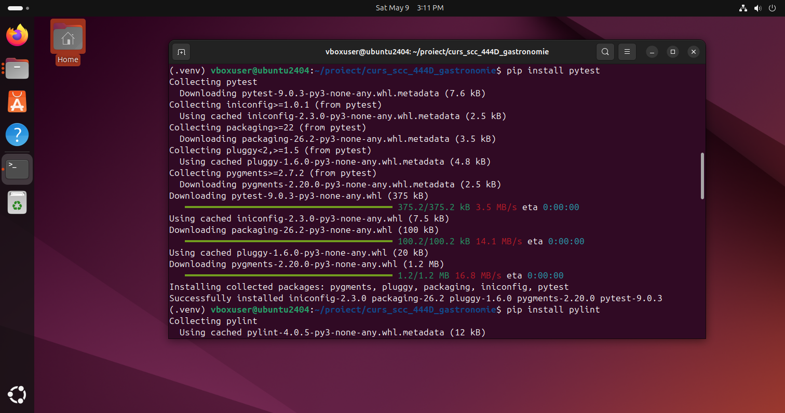

### Creare aplicație Flask

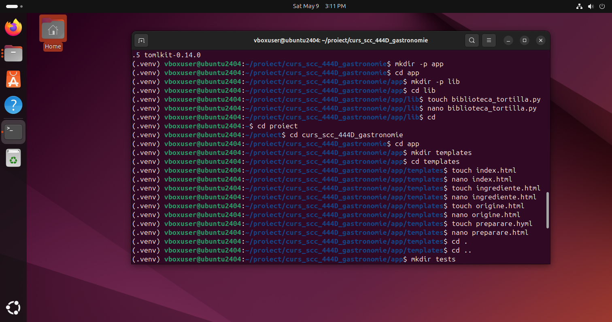

### Rulat teste

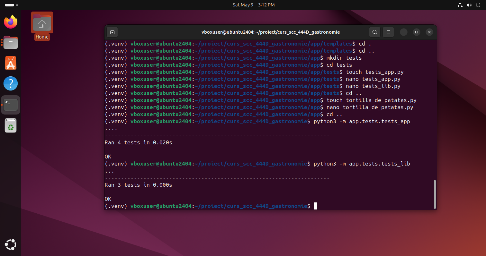

### Testare funcționalitate aplicație

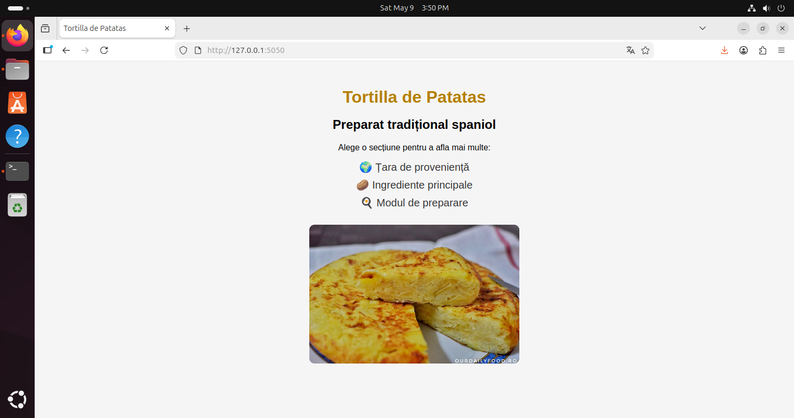

### Testat aplicația

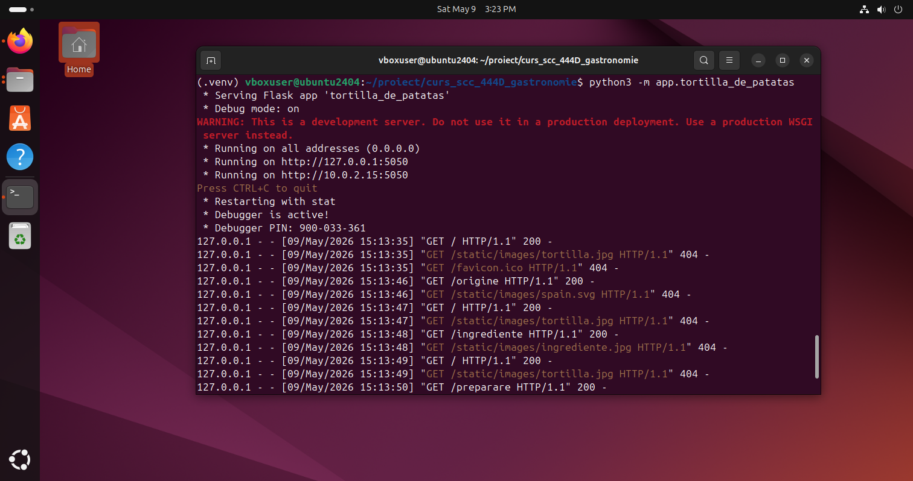

### Activare Jenkins

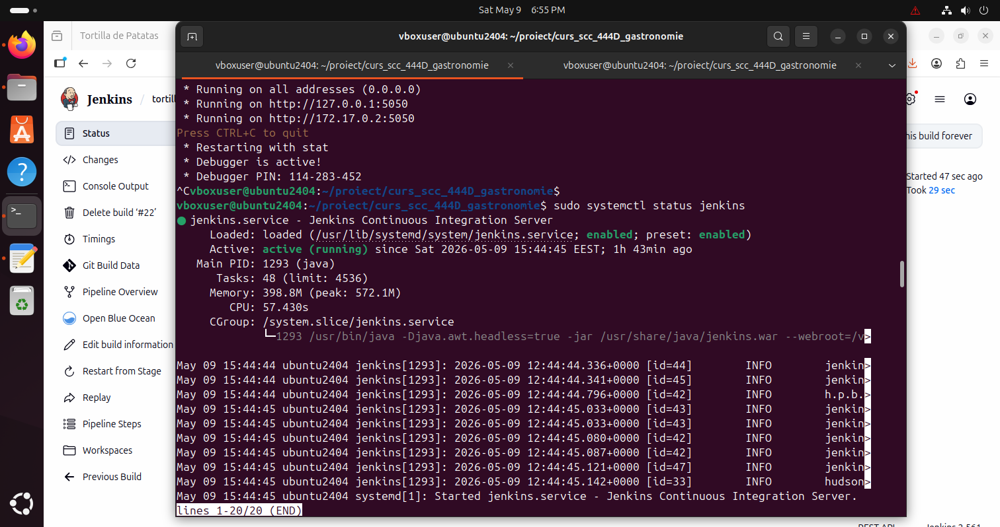

### Testare Jenkins


### Creare Dockerfile

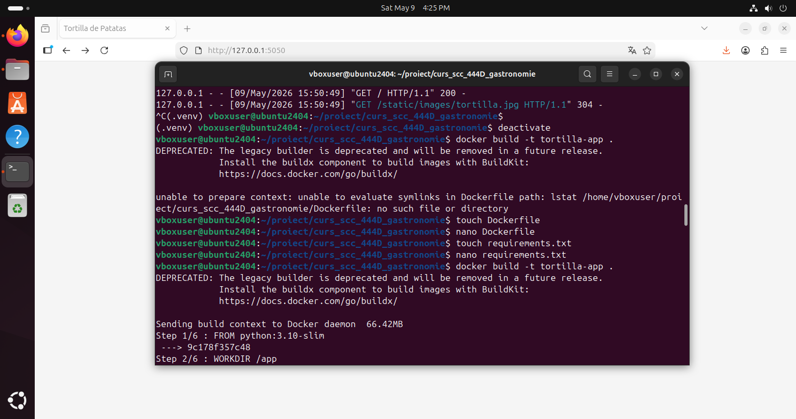

### Build Docker

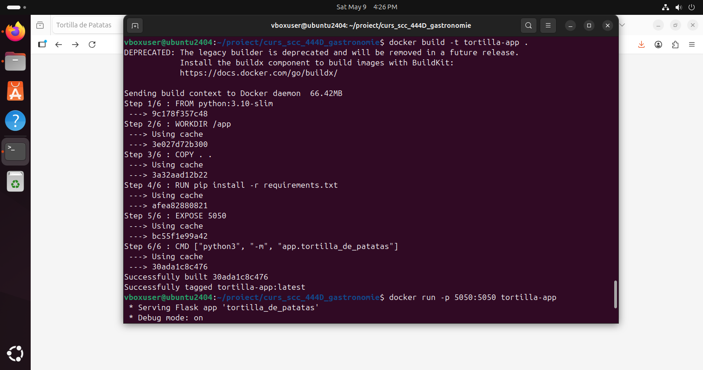

### Docker Images


### Docker PS


### Run Docker

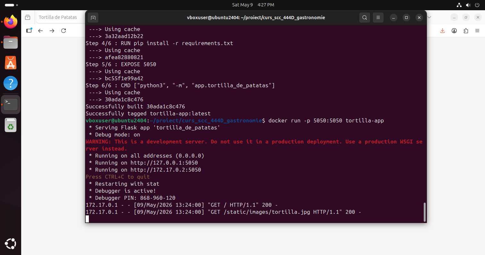

### Push pe Git

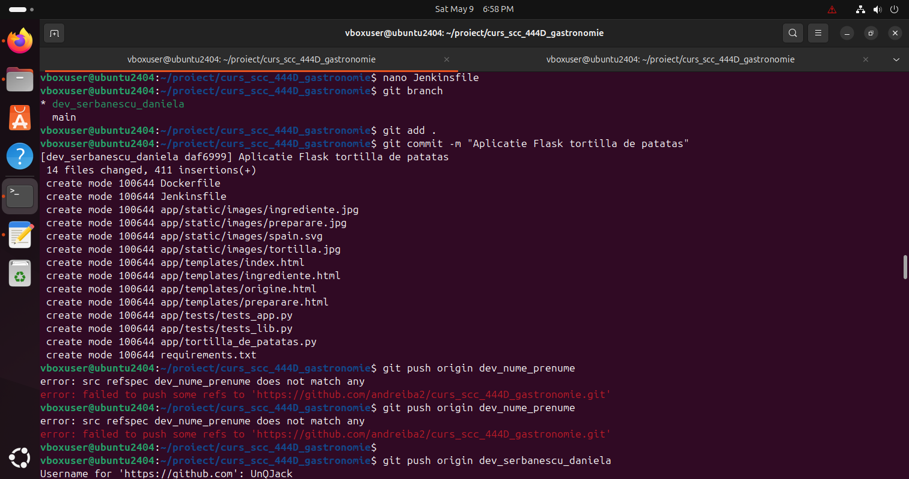

### Push pe Main

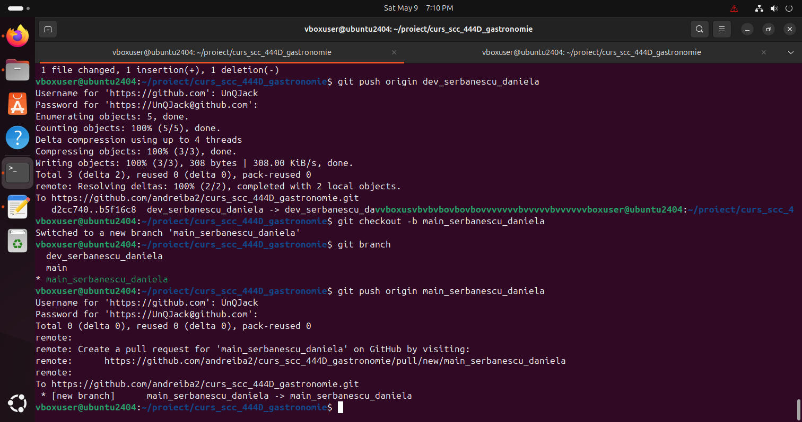
