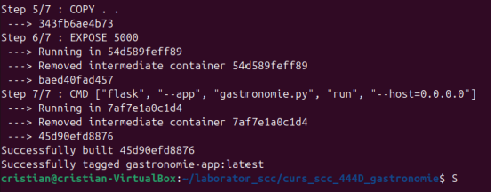
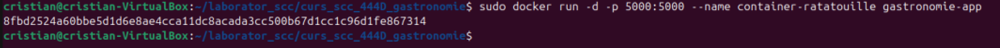
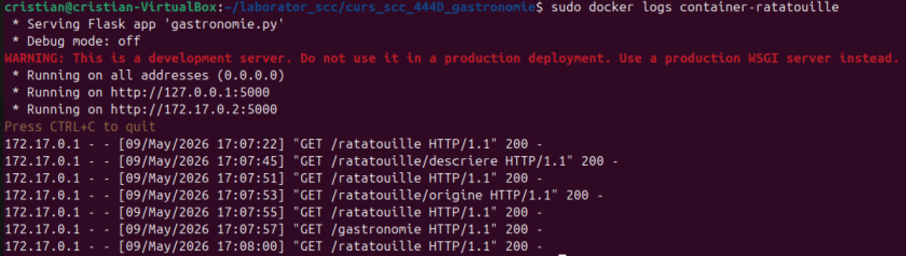
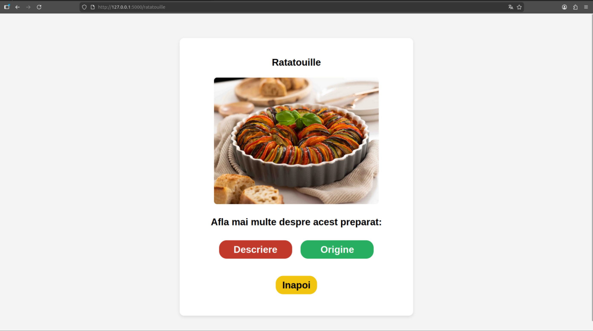
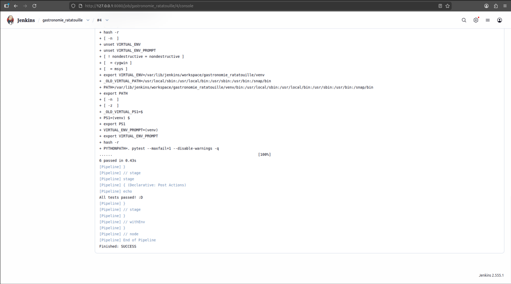

# Gastronomie: Ratatouille

## 1) Funcționalitatea adăugată
- Tema: **Gastronomie**
- Element ales: **Ratatouille**
- Funcții adăugate în `app/lib/biblioteca_gastronomie.py`:
  - `descriere_ratatouille()` – returnează o scurtă descriere a preparatului.
  - `origine_ratatouille()` – returnează un text scurt despre originea preparatului.
- Rute Flask implementate în `gastronomie.py`:
  - `/gastronomie` – pagină de bun venit + buton către Ratatouille
  - `/ratatouille` – pagină element + butoane către descriere/origine
  - `/ratatouille/descriere` – afișează descrierea
  - `/ratatouille/origine` – afișează originea
- Interfață: butoane colorate inspirate din culorile preparatului și o imagine cu prepratul.

---

## 2) Stadiul implementării (dacă codul a fost adăugat)
- Codul a fost adăugat integral în branch-ul de dezvoltare `dev_Stanciulescu_Cristian`.

---

## 3) Testare
- Framework: **pytest**
- Locație: `tests/`
- Status testare: Toate testele au trecut cu succes la executarea prin Jenkins.

---

## 4) Integrare
- PR deschis din `dev_Stanciulescu_Cristian` către `main_Stanciulescu_Cristian`.

---

## 5) Containerizare
- Procesul de creare a imaginii Docker

- Pornirea containerului Docker în background

    
- Log-urile containerului arată că serverul Flask rulează pe `0.0.0.0:5000`

- Pagina cu preparatul de mâncare Ratatouille

- Testele executate folosind Jenkins

