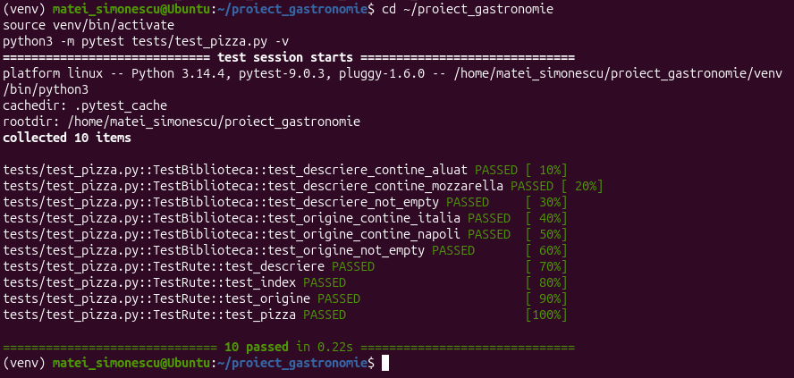
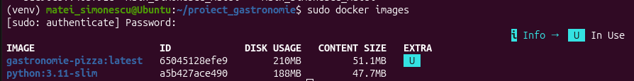
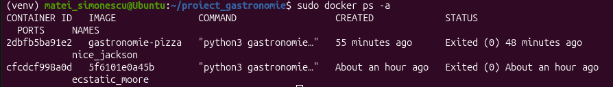
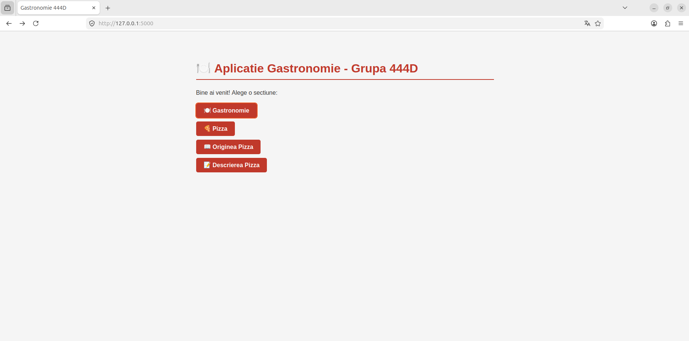
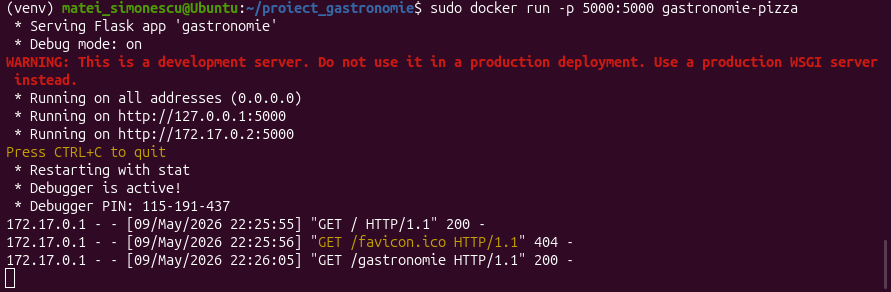

# Gastronomie - Pizza 🍕
**Grupa:** 444D  
**Student:** Simonescu Matei  
**Branch:** `dev_Simonescu_Matei`  
**Element ales:** Pizza

---

## Funcționalitate adăugată

Funcționalitate pentru elementul **Pizza**:

- `app/lib/biblioteca_gastronomie.py`:
  - `origine_pizza()` — istoricul și originea pizza
  - `descriere_pizza()` — descrierea și ingredientele pizza
- `gastronomie.py` — rute adăugate:
  - `/gastronomie` — tema generală
  - `/pizza` — informații complete
  - `/origine_pizza` — originea pizza
  - `/descriere_pizza` — descrierea pizza
- `tests/test_pizza.py` — 10 teste unitare
- `Jenkinsfile` — pipeline Jenkins
- `Dockerfile` — containerizare

---

## Stadiul implementării

| Componenta | Status |
|------------|--------|
| Cod funcționalitate | ✅ Adăugat |
| Cod testare | ✅ Adăugat |
| Jenkins | ✅ Configurat |
| Containerizare | ✅ Realizată |
| Documentație | ✅ Completă |
| PR creat | ✅ PR #40 |
| Review primit | ✅ Primit |
| Integrat în main | ✅ Integrat în main_Simonescu_Matei |

---

## Testare

### Testare manuală
```bash
python3 gastronomie.py
# Accesează http://localhost:5000/pizza
```

### Testare cu pytest
```bash
source venv/bin/activate
python3 -m pytest tests/test_pizza.py -v
```

**Rezultat: 10/10 PASSED ✅**


### Testare cu Jenkins
Jenkinsfile configurat în branch-ul de dezvoltare.

---

## Containerizare

```bash
docker build -t gastronomie-pizza .
docker run -p 5000:5000 gastronomie-pizza
```

Aplicația rulează în container și poate fi accesată la `http://localhost:5000/pizza`.

### Imagine Docker creată


### Container creat


### Browser - aplicație în container


### Consolă container


---
