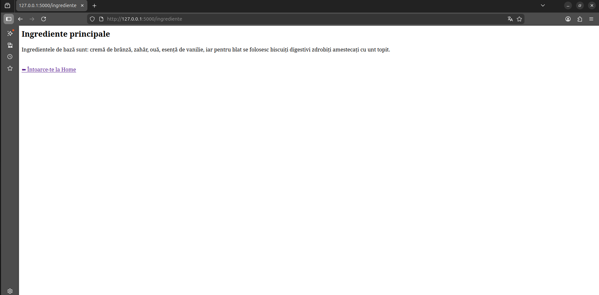
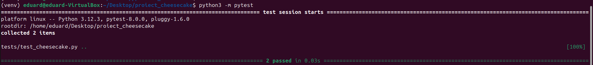
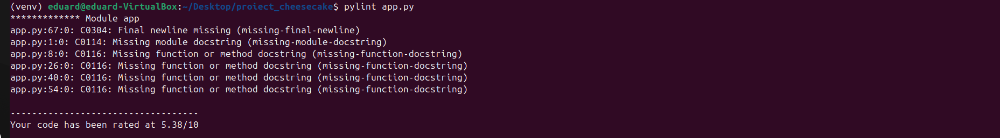

# Proiect Gastronomie: Cheesecake

**Student:** Ionescu Eduard - Nicolae
**Grupă:** 444D

---

## Structură Proiect

```
app/
├── lib/
│   ├── __init__.py
│   └── biblioteca_gastronomie.py  
screenshots/
Dockerfile
Jenkinsfile
LICENSE
README.md
gastronomie.py
requirements.txt
test_gastronomie.py
```

---

## 1. Funcționalitate

Am implementat o aplicație Flask pentru tema Cheesecake. Interfața  conține rute pentru:

- **Proveniență:** 
- **Ingrediente:** 
- **Mod de preparare** 

---

## 2. Stadiul Implementării

- **Cod aplicație:** Finalizat.
- **Teste unitare:** Implementate în `test_gastronomie.py` (validate local).
- **Jenkins Pipeline:** Configurat și funcțional în totalitate.
- **Containerizare:** Fișier Dockerfile creat, imagine construită și testată.

---

## 3. Containerizare

### Build imagine Docker


### Aplicație rulând în container


### Pagina Proveniență


### Pagina Ingrediente



### Pagina Mod de Preparare


---

## 4. Teste

### Rezultat Pytest



### Rezultat Pylint



---

## 5. Jenkins Pipeline


