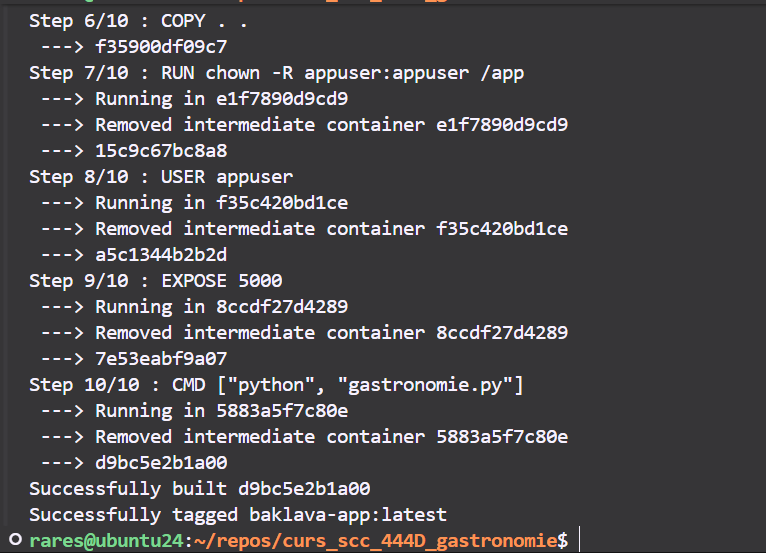
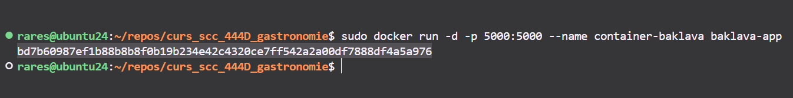
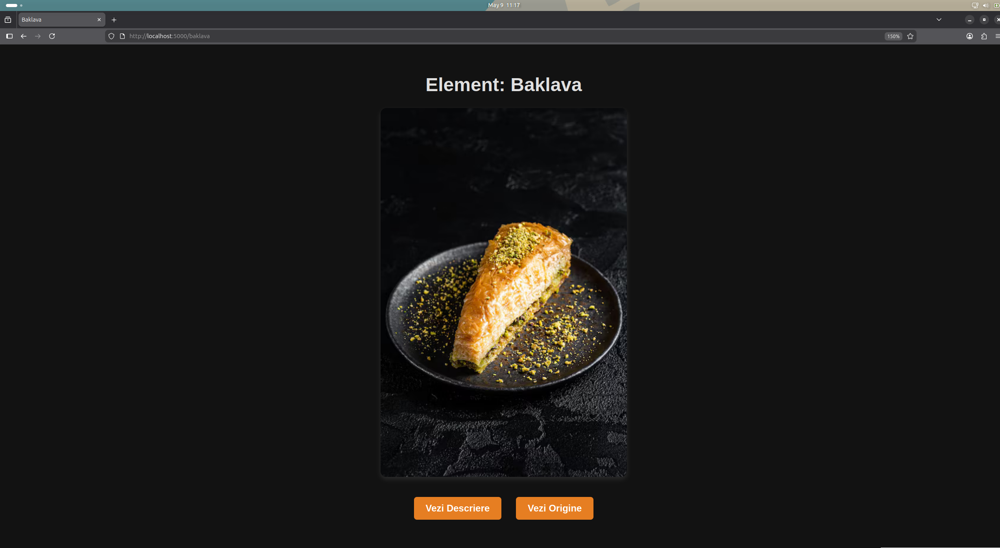
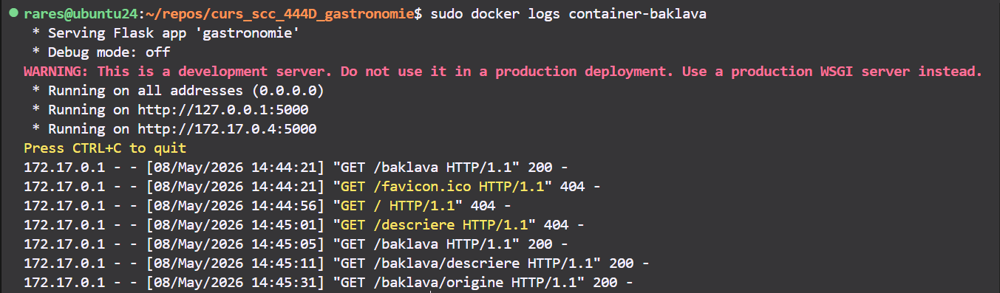
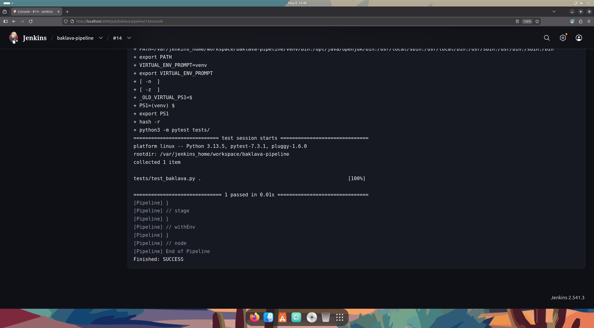

# Element: Baklava

* **Funcționalitate adăugată:** Rutele `/baklava`, `/baklava/descriere`, `/baklava/origine` și funcțiile aferente din `biblioteca_gastronomie.py`.
* **Stadiul implementării:** Codul pentru elementul baklava a fost adăugat integral.
* **Testare:** Fișier Jenkins configurat. Testele unitare (pytest) trec cu succes la testarea manuală și executate prin Jenkins.
* **Integrare:** PR deschis din `dev_Olteanu_Rares` către `main_Olteanu_Rares` (cu rezultate teste atașate). Aștept review pentru PR-ul către ramura `main` pentru README.
* **Containerizare:** Imagine creată și testată local.

  

  

  

  

* **Testare / Jenkins:**

  

* **Rulare:**
```bash
  docker build -t baklava-app .
  docker run -p 5000:5000 baklava-app
```

* **Fișierul README.md:** Actualizat conform cerințelor.
* **Ce mai este de făcut:** Integrarea finală pe branch-ul `main` a fișierului comun.