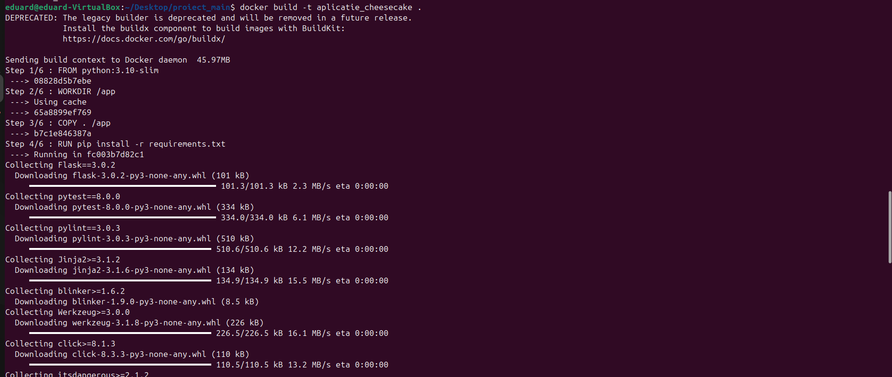
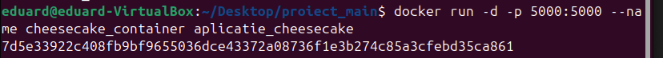
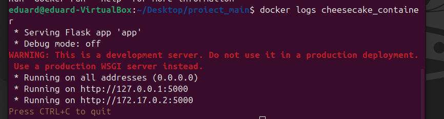
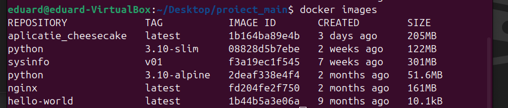
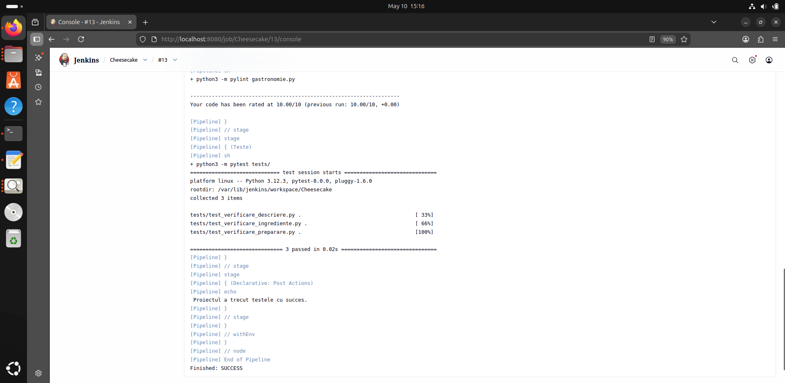

# Proiect Gastronomie: Cheesecake

**Student:** Ionescu Eduard - Nicolae
**Grupă:** 444D

---

## Structură Proiect

```
app/
├── lib/
│   └── biblioteca_gastronomie.py  
screenshots/
tests/
│   └── test_verificare_descriere.py 
│   └── test_verificare_ingrediente.py 
│   └── test_verificare_preparare.py 
Dockerfile
Jenkinsfile
LICENSE
README.md
gastronomie.py
requirements.txt
```

---

## 1. Funcționalitate

Am implementat o aplicație Flask pentru tema Cheesecake. Interfața conține rute pentru:

- **Pagina de start** `/` 
- **Proveniență** `/origine` 
- **Ingrediente** `/ingrediente`
- **Mod de preparare** `/preparare`

---

## 2. Stadiul Implementării

- **Cod aplicație:** Finalizat.
- **Teste unitare:** Implementate în folderul `tests` (test_verificare_descriere, test_verificare_ingrediente, test_verificare_preparare - verificate local si in Jenkins).
- **Jenkins Pipeline:** Configurat și funcțional în totalitate.
- **Containerizare:** Fișier Dockerfile creat, imagine construită și testată.

##Integrare PR #2, #8, #37 inchise din dev_Ionescu_Eduard_Nicolae către main_Ionescu_Eduard_Nicolae. 
##Integrare PR #56 deschis din dev_Ionescu_Eduard_Nicolae către main_Ionescu_Eduard_Nicolae (am atasat rezultatul testelor din Jenkins). 
##Am pus la review README-ul către ramura main.
##Am facut review la PR #55.
---

## 3. Containerizare

### Buildarea si rularea imaginii Docker






---

## 4. Testare manuala - Rutele au fost accesate din browser.

### Aplicație rulând în container


### Pagina Proveniență


### Pagina Ingrediente


### Pagina Mod de Preparare


### Rezultat Pytest
    
    Am pornit local testele cu comanda "python3 -m pytest"


---

## 5. Testare automata - Jenkins Pipeline

Testele au rulat cu succes din Jenkins odata cu finalizarea aplicatiei si dupa fixarea erorilor de build specifice Jenkins.



