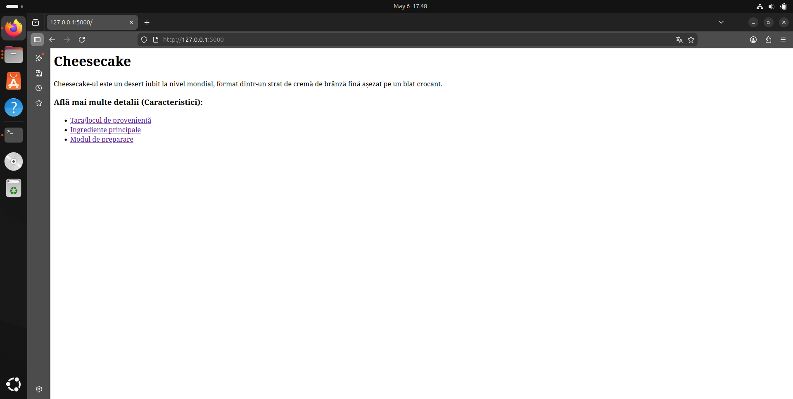
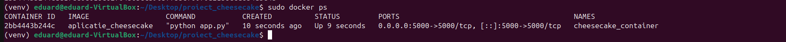
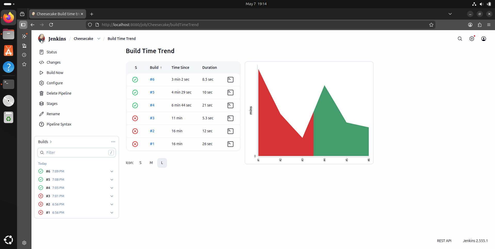

# Proiect Gastronomie: Cheesecake

**Student:** Ionescu Eduard-Nicolae  
**Grupă:** 444D

## Structură Proiect

```text
.
├── lib/
│   └── __init__.py
├── screenshots/            # Capturi de ecran (Docker, Jenkins, Aplicație)
├── tests/                  # Teste unitare (pytest)
├── Dockerfile              # Configurare Docker
├── Jenkinsfile             # Pipeline CI/CD
├── gastronomie.py          # Aplicația Flask
├── requirements.txt        # Dependențe Python
└── README.md               # Documentația proiectului

1. Funcționalitate
Am implementat o aplicație Flask  axată pe desertul Cheesecake. Interfața  conține rute pentru:

Origine

Ingrediente

Mod de preparare



## 2. Stadiul implementării

* **Cod aplicație:** Finalizat.
* **Teste unitare:** Implementate în folderul tests/ și validate local.
* **Jenkins Pipeline:** Configurat și funcțional în totalitate.
* **Containerizare:** Fișier Dockerfile creat, imagine construită și testată.

## 3. Containerizare

Am utilizat Docker pentru a asigura portabilitatea aplicației. Mai jos sunt dovezile pentru imaginea creată și containerul care rulează:



Aplicația rulează în container și este expusă pe portul 5000:


## 4. Integrare Continuă (Jenkins)

Pipeline-ul declarativ din Jenkins automatizează procesul de verificare a codului și rularea testelor la fiecare push.

### Build Time Trend
Graficul de mai jos arată succesul build-urilor și stabilitatea pipeline-ului:




