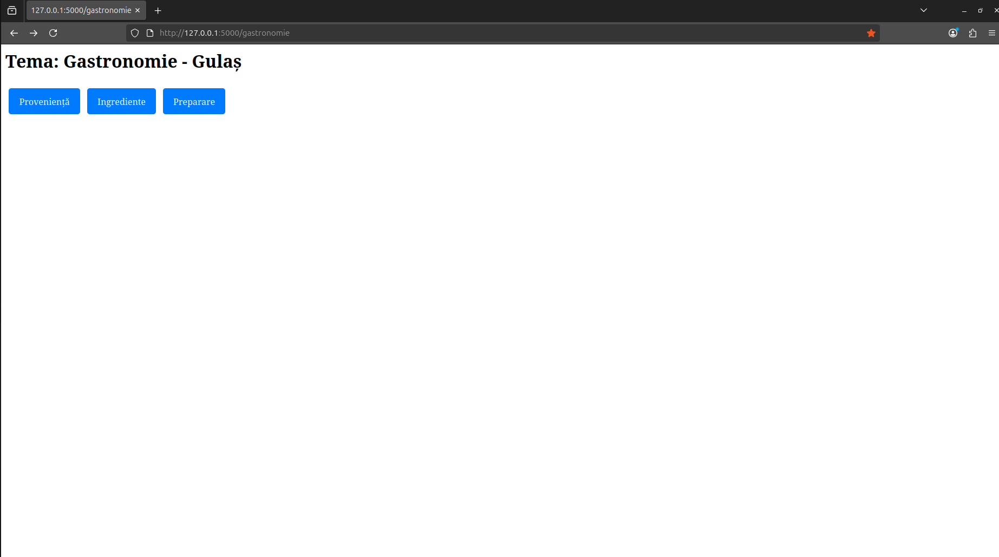
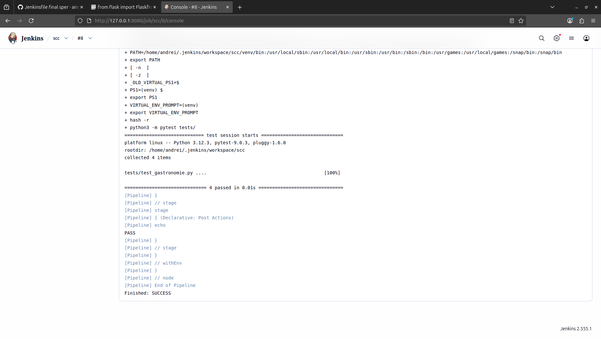
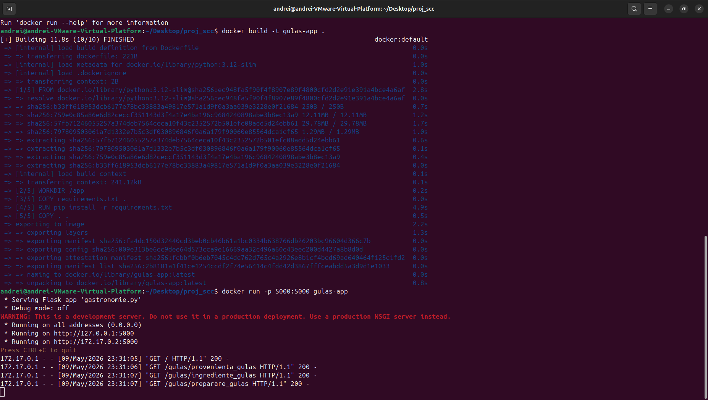
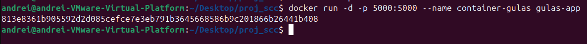

# curs_scc_444D_gastronomie
# Gulaș — Guta Andrei-Petrisor (444D)

## Funcționalitati adăugate
- Funcția `provenienta_gulas()` — returnează originea istorică a gulașului
- Funcția `ingrediente_gulas()` — returnează ingredientele principale
- Funcția `preparare_gulas()` — returnează metoda de preparare
- 
Rute disponibile:
- `/gastronomie` — pagina temei
- `/gulas` — pagina elementului
- `/gulas/provenienta_gulas` — originea gulașului
- `/gulas/ingrediente_gulas` — ingredientele gulașului
- `/gulas/preparare_gulas` — prepararea gulașului
  

## Testare
### Testare manuală
Aplicația a fost pornită local cu `python3 gastronomie.py` și rutele au fost accesate din browser.

### Testare cu Jenkins
Testele rulate manual si cu automat cu Jenkins utilizand `pytest`. Rezultat: **PASS**

##Integrare
PR deschis din `dev_Guta_Andrei` către `main_Guta_Andrei` (cu rezultate teste atașate). Aștept review pentru PR-ul către ramura `main` pentru README.

## Containerizare
Imagine creata si testare locala.

Docker build and run

Id container Docker

Docker Logs

Docker Images

