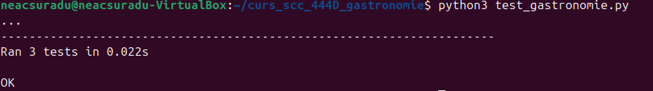
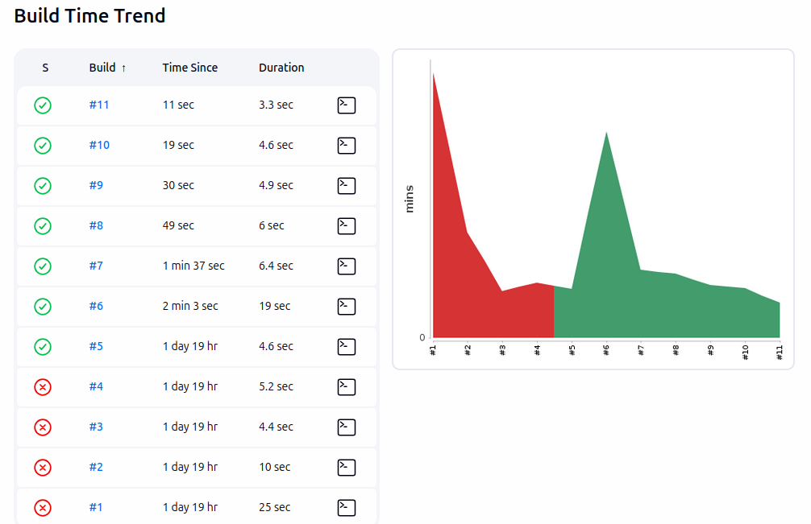

# Proiect SCC - Gastronomie (Margherita)

**Student:** Neacșu Radu-Costin  
**Grupa:** 444D  
**Branch dezvoltare:** dev_neacsu_radu  
**Branch principal:** main_neacsu_radu  

### 1. Funcționalitate
Am implementat o aplicație Flask pentru tema Gastronomie, axată pe Pizza Margherita. Interfața este interactivă și conține rute pentru:
- **Principală:** Pagina de start și meniul de navigare.
- **Proveniență:** Detalii despre originile preparatului.
- **Ingrediente:** Listarea componentelor principale.
- **Mod de preparare:** Descrierea procesului de gătire.

### 2. Stadiul implementării
- **Cod aplicație:** Finalizat. Rutele și funcțiile Flask au fost implementate cu succes.
- **Teste unitare:** Implementate în `test_gastronomie.py` (validate local).
- **Testare manuală:** Interfața web a fost validată manual prin accesarea fiecărei rute în browser pe `localhost:5000`, asigurând afișarea corectă a conținutului și funcționarea butoanelor.

- **Jenkins Pipeline:** Configurat și funcțional în totalitate. Testele automate trec cu statusul PASS.
- **Containerizare:** Fișier `Dockerfile` creat, imagine construită și testată cu succes.
- **Integrare:** Codul a fost împins pe branch-ul `dev_neacsu_radu`. Pull Request-ul către `main_neacsu_radu` a fost creat, aprobat și integrat cu succes.
- **Review-uri acordate:** Am realizat code review pentru un coleg de echipă.

### 3. Testare Automată (Jenkins)
- Testele unitare au fost rulate cu succes folosind un pipeline declarativ.
- Rezultat Jenkins: PASS. Istoricul execuției și pipeline-ul vizual:

### 4. Containerizare (Docker)
Aplicația a fost containerizată și testată. Dovezi:

- **Imaginea creată:** 

- **Containerul creat:** 

- **Mesaje consolă:** 

- **Acces din browser (Paginile aplicației):** *Pagina Principală:*

*Pagina Proveniență:*

*Pagina Ingrediente:*

*Pagina Preparare:*

